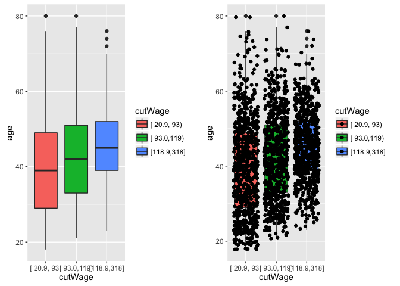
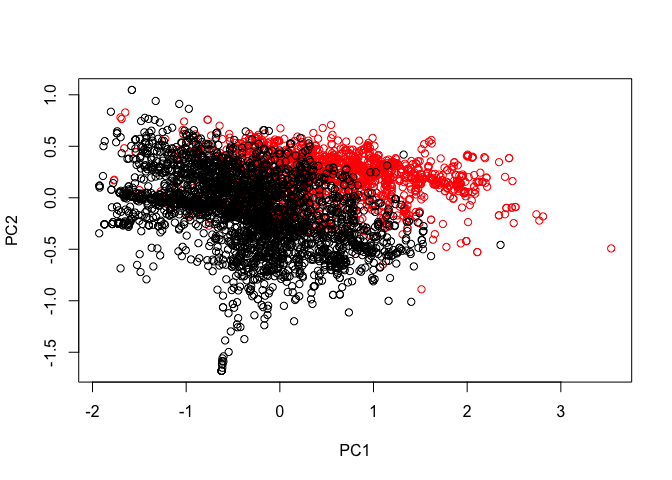
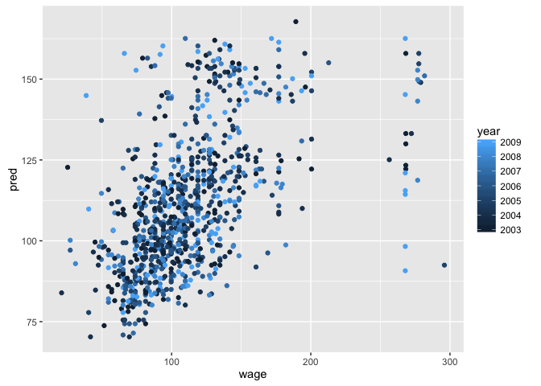
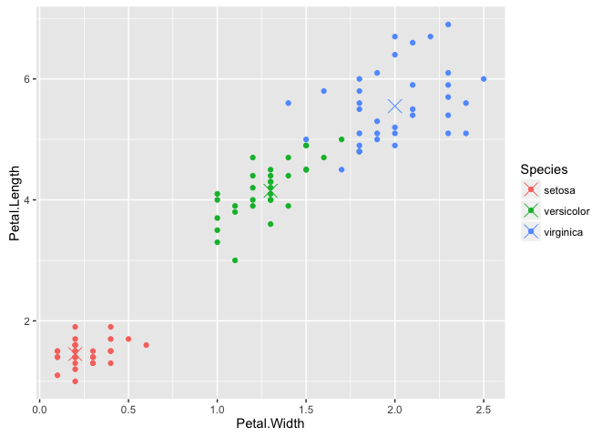

------------------------------------------------------------------------

<span style="color:blue"> *Catalog* </span>
-------------------------------------------

1.  Caret Package
2.  Data Slicing
3.  Training Options
4.  Plotting Predictors
5.  Preprocessing
6.  Covariate Creation
7.  Preprocessing with Pricipal Components Analysis (PCA)
8.  Predicting with Regression
9.  Predicting with Regression, multiple covariates
10. Predicting with Trees
11. Bagging
12. Random Forests
13. Boosting
14. Model Based Predictions
15. Regularized Regression
16. Combining Predictors
17. Forcasting
18. Unsupervised Prediction

<span style="color:blue"> *1. Caret Package* </span>
----------------------------------------------------

### Data Splitting

``` r
library(lattice); library(caret); library(kernlab); data(spam)
inTrain <- createDataPartition(y=spam$type, p = 0.75, list = FALSE)
training <- spam[inTrain,]
testing <- spam[-inTrain,]
dim(training)
```

    ## [1] 3451   58

``` r
dim(testing)
```

    ## [1] 1150   58

### Fit a Model

``` r
set.seed(32343)
## We can use glm or other models
modelFit <- train(type ~ ., data = training, method = "glm") 
modelFit
```

    ## Generalized Linear Model 
    ## 
    ## 3451 samples
    ##   57 predictor
    ##    2 classes: 'nonspam', 'spam' 
    ## 
    ## No pre-processing
    ## Resampling: Bootstrapped (25 reps) 
    ## Summary of sample sizes: 3451, 3451, 3451, 3451, 3451, 3451, ... 
    ## Resampling results:
    ## 
    ##   Accuracy   Kappa    
    ##   0.9232469  0.8381359
    ## 
    ## 

### Final Model

``` r
modelFit$finalModel
```

    ## 
    ## Call:  NULL
    ## 
    ## Coefficients:
    ##       (Intercept)               make            address  
    ##        -1.395e+00         -5.565e-01         -1.697e-01  
    ##               all              num3d                our  
    ##         6.407e-03          1.795e+00          6.087e-01  
    ##              over             remove           internet  
    ##         1.075e+00          2.321e+00          3.537e-01  
    ##             order               mail            receive  
    ##         5.821e-01          9.121e-02         -1.142e-02  
    ##              will             people             report  
    ##        -1.911e-01         -1.359e-01          4.333e-01  
    ##         addresses               free           business  
    ##         1.368e+00          1.265e+00          9.922e-01  
    ##             email                you             credit  
    ##         8.926e-02          6.493e-02          6.208e-01  
    ##              your               font             num000  
    ##         2.638e-01          2.021e-01          1.980e+00  
    ##             money                 hp                hpl  
    ##         5.093e-01         -1.734e+00         -7.944e-01  
    ##            george             num650                lab  
    ##        -1.054e+01          5.534e-01         -3.494e+00  
    ##              labs             telnet             num857  
    ##        -7.626e-01         -9.181e-02          2.751e+00  
    ##              data             num415              num85  
    ##        -6.341e-01          2.060e+00         -2.156e+00  
    ##        technology            num1999              parts  
    ##         8.544e-01         -2.130e-01         -7.909e-01  
    ##                pm             direct                 cs  
    ##        -6.388e-01         -5.687e-01         -5.479e+02  
    ##           meeting           original            project  
    ##        -2.428e+00         -1.228e+00         -1.421e+00  
    ##                re                edu              table  
    ##        -8.414e-01         -1.459e+00         -2.286e+00  
    ##        conference      charSemicolon   charRoundbracket  
    ##        -3.534e+00         -1.248e+00         -8.651e-01  
    ## charSquarebracket    charExclamation         charDollar  
    ##        -4.929e-01          2.320e-01          6.907e+00  
    ##          charHash         capitalAve        capitalLong  
    ##         3.045e+00          2.402e-03          9.645e-03  
    ##      capitalTotal  
    ##         7.353e-04  
    ## 
    ## Degrees of Freedom: 3450 Total (i.e. Null);  3393 Residual
    ## Null Deviance:       4628 
    ## Residual Deviance: 1335  AIC: 1451

### Prediction

``` r
predictions <- predict(modelFit, newdata = testing)
head(predictions, 20)
```

    ##  [1] spam    spam    spam    spam    spam    spam    spam    nonspam
    ##  [9] nonspam spam    nonspam spam    spam    spam    nonspam spam   
    ## [17] spam    spam    spam    spam   
    ## Levels: nonspam spam

### Confusion Matrix

``` r
confusionMatrix(predictions, testing$type)
```

    ## Confusion Matrix and Statistics
    ## 
    ##           Reference
    ## Prediction nonspam spam
    ##    nonspam     656   47
    ##    spam         41  406
    ##                                           
    ##                Accuracy : 0.9235          
    ##                  95% CI : (0.9066, 0.9382)
    ##     No Information Rate : 0.6061          
    ##     P-Value [Acc > NIR] : <2e-16          
    ##                                           
    ##                   Kappa : 0.8394          
    ##  Mcnemar's Test P-Value : 0.594           
    ##                                           
    ##             Sensitivity : 0.9412          
    ##             Specificity : 0.8962          
    ##          Pos Pred Value : 0.9331          
    ##          Neg Pred Value : 0.9083          
    ##              Prevalence : 0.6061          
    ##          Detection Rate : 0.5704          
    ##    Detection Prevalence : 0.6113          
    ##       Balanced Accuracy : 0.9187          
    ##                                           
    ##        'Positive' Class : nonspam         
    ## 

<span style="color:blue"> *2. Data Slicing* </span>
---------------------------------------------------

### Data Splitting

``` r
library(lattice); library(caret); library(kernlab); data(spam)
inTrain <- createDataPartition(y=spam$type, p = 0.75, list = FALSE)
training <- spam[inTrain,]
testing <- spam[-inTrain,]
dim(training)
```

    ## [1] 3451   58

``` r
dim(testing)
```

    ## [1] 1150   58

### K-fold - Return Training Set

``` r
set.seed(32323)
folds <- createFolds(y=spam$type, k=10, list=TRUE, returnTrain=TRUE)
sapply(folds, length)
```

    ## Fold01 Fold02 Fold03 Fold04 Fold05 Fold06 Fold07 Fold08 Fold09 Fold10 
    ##   4141   4140   4141   4142   4140   4142   4141   4141   4140   4141

``` r
# Returns the indices of the training set
folds[[1]][1:10]
```

    ##  [1]  1  2  3  4  5  6  7  8  9 10

### K-fold - Return Test Set

``` r
set.seed(32323)
folds <- createFolds(y=spam$type, k=10, list=TRUE, returnTrain=FALSE)
sapply(folds, length)
```

    ## Fold01 Fold02 Fold03 Fold04 Fold05 Fold06 Fold07 Fold08 Fold09 Fold10 
    ##    460    461    460    459    461    459    460    460    461    460

``` r
# Returns the indices of the test set
folds[[1]][1:10]
```

    ##  [1] 24 27 32 40 41 43 55 58 63 68

### Resampling

``` r
set.seed(32323)
folds <- createResample(y=spam$type, times=10, list=TRUE)
sapply(folds, length)
```

    ## Resample01 Resample02 Resample03 Resample04 Resample05 Resample06 
    ##       4601       4601       4601       4601       4601       4601 
    ## Resample07 Resample08 Resample09 Resample10 
    ##       4601       4601       4601       4601

``` r
# Index 3 is repeated by 3 times because of the resampling method
folds[[1]][1:10]
```

    ##  [1]  1  2  3  3  3  5  5  7  8 12

### Time Slices

For analyzing the data used for forcasting.

``` r
set.seed(32323)
tme <- 1:1000
# initialWindow: create slices that have windows with 20 samples in them
# horizon: predict the next 10 samples out
folds <- createTimeSlices(y=tme, initialWindow=20, horizon=10)
names(folds)
```

    ## [1] "train" "test"

``` r
folds$train[[1]]
```

    ##  [1]  1  2  3  4  5  6  7  8  9 10 11 12 13 14 15 16 17 18 19 20

``` r
folds$test[[1]]
```

    ##  [1] 21 22 23 24 25 26 27 28 29 30

<span style="color:blue"> *3. Training Options* </span>
-------------------------------------------------------

``` r
args(train.default)
```

    ## function (x, y, method = "rf", preProcess = NULL, ..., weights = NULL, 
    ##     metric = ifelse(is.factor(y), "Accuracy", "RMSE"), maximize = ifelse(metric %in% 
    ##         c("RMSE", "logLoss"), FALSE, TRUE), trControl = trainControl(), 
    ##     tuneGrid = NULL, tuneLength = 3) 
    ## NULL

### Metric Options:

Continuous outcomes:
- RMSE = Root mean squared error
- RSquared = R^2 from regression models
Categorical outcomes:
- Accuracy = Fraction correct
- Kappa = A measure of concordance

### trainControl

``` r
args(trainControl)
```

    ## function (method = "boot", number = ifelse(grepl("cv", method), 
    ##     10, 25), repeats = ifelse(grepl("cv", method), 1, number), 
    ##     p = 0.75, search = "grid", initialWindow = NULL, horizon = 1, 
    ##     fixedWindow = TRUE, verboseIter = FALSE, returnData = TRUE, 
    ##     returnResamp = "final", savePredictions = FALSE, classProbs = FALSE, 
    ##     summaryFunction = defaultSummary, selectionFunction = "best", 
    ##     preProcOptions = list(thresh = 0.95, ICAcomp = 3, k = 5), 
    ##     sampling = NULL, index = NULL, indexOut = NULL, indexFinal = NULL, 
    ##     timingSamps = 0, predictionBounds = rep(FALSE, 2), seeds = NA, 
    ##     adaptive = list(min = 5, alpha = 0.05, method = "gls", complete = TRUE), 
    ##     trim = FALSE, allowParallel = TRUE) 
    ## NULL

### trainControl resampling

-   method
     - boot = bootstrapping
     - boot632 = bootstrapping with adjustment (reduced bias)
     - cv = cross validation
     - repeatedcv = repeated cross validation
     - LOOCV = leave one out cross validation (leave one out cross validation)
-   number
     - For boot/cross validation
     - Number of subsamples to take
-   repeats
     - Number of times to repeat subsampling
     - If big this can slow things down

### seed example

``` r
set.seed(1235)
modelFit2 <- train(type ~., data=training, method="glm")
modelFit2
```

    ## Generalized Linear Model 
    ## 
    ## 3451 samples
    ##   57 predictor
    ##    2 classes: 'nonspam', 'spam' 
    ## 
    ## No pre-processing
    ## Resampling: Bootstrapped (25 reps) 
    ## Summary of sample sizes: 3451, 3451, 3451, 3451, 3451, 3451, ... 
    ## Resampling results:
    ## 
    ##   Accuracy  Kappa    
    ##   0.923171  0.8391963
    ## 
    ## 

<span style="color:blue"> *4. Plotting Predictors* </span>
----------------------------------------------------------

### 1. Get data

``` r
library(ISLR); library(ggplot2); library(caret)
data(Wage)
summary(Wage)
```

    ##       year           age               sex                    maritl    
    ##  Min.   :2003   Min.   :18.00   1. Male  :3000   1. Never Married: 648  
    ##  1st Qu.:2004   1st Qu.:33.75   2. Female:   0   2. Married      :2074  
    ##  Median :2006   Median :42.00                    3. Widowed      :  19  
    ##  Mean   :2006   Mean   :42.41                    4. Divorced     : 204  
    ##  3rd Qu.:2008   3rd Qu.:51.00                    5. Separated    :  55  
    ##  Max.   :2009   Max.   :80.00                                           
    ##                                                                         
    ##        race                   education                     region    
    ##  1. White:2480   1. < HS Grad      :268   2. Middle Atlantic   :3000  
    ##  2. Black: 293   2. HS Grad        :971   1. New England       :   0  
    ##  3. Asian: 190   3. Some College   :650   3. East North Central:   0  
    ##  4. Other:  37   4. College Grad   :685   4. West North Central:   0  
    ##                  5. Advanced Degree:426   5. South Atlantic    :   0  
    ##                                           6. East South Central:   0  
    ##                                           (Other)              :   0  
    ##            jobclass               health      health_ins      logwage     
    ##  1. Industrial :1544   1. <=Good     : 858   1. Yes:2083   Min.   :3.000  
    ##  2. Information:1456   2. >=Very Good:2142   2. No : 917   1st Qu.:4.447  
    ##                                                            Median :4.653  
    ##                                                            Mean   :4.654  
    ##                                                            3rd Qu.:4.857  
    ##                                                            Max.   :5.763  
    ##                                                                           
    ##       wage       
    ##  Min.   : 20.09  
    ##  1st Qu.: 85.38  
    ##  Median :104.92  
    ##  Mean   :111.70  
    ##  3rd Qu.:128.68  
    ##  Max.   :318.34  
    ## 

### 2. Get training/test sets

``` r
inTrain <- createDataPartition(y=Wage$wage, p=0.7, list=FALSE)
training <- Wage[inTrain, ]
testing <- Wage[-inTrain, ]
dim(training); dim(testing)
```

    ## [1] 2102   12

    ## [1] 898  12

### 3. Feature plot (caret package)

``` r
featurePlot(x=training[, c("age", "education", "jobclass")],
            y=training$wage,
            plot="pairs")
```

<!-- -->

### 4. Qplot (ggplot2 package)

``` r
qplot(age, wage, data = training)
```

<!-- -->

``` r
qplot(age, wage, color=jobclass, data = training)
```

<!-- -->

### 5. Add regression smoothers (ggplot2)

``` qq
qq <- qplot(age, wage, color=education, data=training)
qq + geom_smooth(method="lm", formula=y~x)
```

### 6. cut2, making factors (Hmisc package)

``` r
library(Hmisc)
cutWage <- cut2(training$wage, g=3)
table(cutWage)
```

    ## cutWage
    ## [ 20.9, 93) [ 93.0,119) [118.9,318] 
    ##         713         715         674

### 7. Boxplots with cut2

``` r
p1 <- qplot(cutWage, age, data = training, fill=cutWage, geom = c("boxplot"))
p1
```

<!-- -->

### 8. Boxplots with points overlayed

``` r
library(gridExtra)
p2 <- qplot(cutWage, age, data = training, fill=cutWage, geom=c("boxplot","jitter"))
grid.arrange(p1, p2, ncol=2)
```

<!-- -->

### 9. Tables

``` r
t1 <- table(cutWage, training$jobclass)
t1
```

    ##              
    ## cutWage       1. Industrial 2. Information
    ##   [ 20.9, 93)           446            267
    ##   [ 93.0,119)           358            357
    ##   [118.9,318]           265            409

``` r
prop.table(t1,1)
```

    ##              
    ## cutWage       1. Industrial 2. Information
    ##   [ 20.9, 93)     0.6255259      0.3744741
    ##   [ 93.0,119)     0.5006993      0.4993007
    ##   [118.9,318]     0.3931751      0.6068249

### 10. Density Plots

``` r
qplot(wage, color=education, data = training, geom = "density")
```

<!-- -->

<span style="color:blue"> *5. Preprocessing* </span>
----------------------------------------------------

### Why preprocess?

This histogram shows the average number of capital letters in a row. We can see that almost all of the numbers are very small, but several huge numbers, which very skewed. This is very hard to process.

``` r
library(caret); library(kernlab); data(spam)
inTrain <- createDataPartition(spam$type, p=0.75, list=FALSE)
training <- spam[inTrain, ]
testing <- spam[-inTrain, ]
hist(training$capitalAve, main = "", xlab = "ave. capital run length")
```

<!-- -->

We can see that the standard deviation is much much larger than the mean, which means the data is very skewed. We need to preprocess the data so the machine learning algorithm won't be tricked by the skewness.

``` r
mean(training$capitalAve)
```

    ## [1] 4.716994

``` r
sd(training$capitalAve)
```

    ## [1] 26.82555

### Standardizing

If we standardize the variables, the mean would be 0 and sd would be 1. So there would be less variation.

``` r
trainCapAve <- training$capitalAve
trainCapAveS <- (trainCapAve - mean(trainCapAve)) / sd(trainCapAve)
mean(trainCapAveS)
```

    ## [1] -6.935532e-18

``` r
sd(trainCapAveS)
```

    ## [1] 1

!!! When standardizing the test set, we have to use the mean and sd of the training set. This means that the mean of the standardized set would not be 0, and sd would not be 1.

``` r
testCapAve <- testing$capitalAve
testCapAveS <- (testCapAve - mean(trainCapAve)) / sd(trainCapAve)
mean(testCapAveS)
```

    ## [1] 0.07077199

``` r
sd(testCapAveS)
```

    ## [1] 1.610786

### Standardizing - preProcess function

Apply to training set:

``` r
preObj <- preProcess(training[,-58], method = c("center", "scale"))
trainCapAveS <- predict(preObj, training[,-58])$capitalAve
mean(trainCapAveS)
```

    ## [1] -6.935532e-18

``` r
sd(trainCapAveS)
```

    ## [1] 1

Apply to testing set:

``` r
testCapAveS <- predict(preObj, testing[,-58])$capitalAve
mean(testCapAveS)
```

    ## [1] 0.07077199

``` r
sd(testCapAveS)
```

    ## [1] 1.610786

Or we can pass the preProcess function directly to the train function:

``` r
set.seed(32343)
modelFit <- train(type ~., data = training, 
                  preProcess=c("center","scale"), method = "glm")
modelFit
```

    ## Generalized Linear Model 
    ## 
    ## 3451 samples
    ##   57 predictor
    ##    2 classes: 'nonspam', 'spam' 
    ## 
    ## Pre-processing: centered (57), scaled (57) 
    ## Resampling: Bootstrapped (25 reps) 
    ## Summary of sample sizes: 3451, 3451, 3451, 3451, 3451, 3451, ... 
    ## Resampling results:
    ## 
    ##   Accuracy   Kappa    
    ##   0.9208656  0.8332911
    ## 
    ## 

### Standardizing - Box-Cox transforms

Take continuous data and try to make them look like normal data.

``` r
preObj <- preProcess(training[,-58], method=c("BoxCox"))
trainCapAveS <- predict(preObj, training[,-58])$capitalAve
par(mfrow=c(1,2)); hist(trainCapAveS); qqnorm(trainCapAveS)
```

<!-- -->

### Standardizing - Imputing data (Dealing with NAs)

The prediction function would fail if there is missing data, so we need to impute data.

``` r
set.seed(13343)

# Make some values NA
training$capAve <- training$capitalAve
selectNA <- rbinom(dim(training)[1], size=1, prob=0.05)==1
training$capAve[selectNA] <- NA

# Impute and standardize
preObj <- preProcess(training[,-58], method="knnImpute")
capAve <- predict(preObj, training[,-58])$capAve

# Standardize true values
capAveTruth <- training$capitalAve
capAveTruth <- (capAveTruth - mean(capAveTruth)) / sd(capAveTruth)
```

``` r
# We can see how close the data to each other (before and after imputation)
quantile(capAve - capAveTruth)
```

    ##            0%           25%           50%           75%          100% 
    ## -1.1884293998 -0.0008836469  0.0005853112  0.0012905270  1.0145601207

``` r
# We can see just the values we imputed
quantile((capAve - capAveTruth)[selectNA])
```

    ##           0%          25%          50%          75%         100% 
    ## -1.188429400 -0.011925252  0.003908074  0.025463933  1.014560121

``` r
quantile((capAve - capAveTruth)[!selectNA])
```

    ##            0%           25%           50%           75%          100% 
    ## -0.9757406838 -0.0008010270  0.0005776479  0.0012414810  0.0018085649

<span style="color:blue"> *6. Covariate Creation* </span>
---------------------------------------------------------

### Two levels of covariate creation

Level 1: From raw data to covariate (E.g.: a passage ---&gt; you: 2, numDollar: 8 ...)
Level 2: Transforming tidy covariates (E.g.: capitalAveS ---&gt; capitalAveS^2)

### Example

``` r
library(ISLR); library(caret); data("Wage")
inTrain <- createDataPartition(Wage$wage, p = 0.7, list = FALSE)
training <- Wage[inTrain, ]; testing <- Wage[-inTrain, ]
```

### Dummy variables: convert factor variables to indicator variables

E.g.: Convert factors "Industrial" and "Information" to 1 and 0.

``` r
table(training$jobclass)
```

    ## 
    ##  1. Industrial 2. Information 
    ##           1051           1051

``` r
dummies <- dummyVars(wage ~ jobclass, data=training)
head(predict(dummies, newdata=training))
```

    ##        jobclass.1. Industrial jobclass.2. Information
    ## 86582                       0                       1
    ## 161300                      1                       0
    ## 155159                      0                       1
    ## 11443                       0                       1
    ## 376662                      0                       1
    ## 450601                      1                       0

### Removing zero covariates

Some of the variables have no variability in them. For example, the variable "no letter in an e-mail" would always be TRUE, so it has no variability (useless).

We need to identify those variables that have very small variabilities.
saveMetrics=TRUE enables us to see the calculations.

``` r
nsv <- nearZeroVar(training, saveMetrics=TRUE)
nsv
```

    ##            freqRatio percentUnique zeroVar   nzv
    ## year        1.037356    0.33301618   FALSE FALSE
    ## age         1.027027    2.85442436   FALSE FALSE
    ## sex         0.000000    0.04757374    TRUE  TRUE
    ## maritl      3.272931    0.23786870   FALSE FALSE
    ## race        8.938776    0.19029496   FALSE FALSE
    ## education   1.389002    0.23786870   FALSE FALSE
    ## region      0.000000    0.04757374    TRUE  TRUE
    ## jobclass    1.000000    0.09514748   FALSE FALSE
    ## health      2.468647    0.09514748   FALSE FALSE
    ## health_ins  2.352472    0.09514748   FALSE FALSE
    ## logwage     1.061728   19.17221694   FALSE FALSE
    ## wage        1.061728   19.17221694   FALSE FALSE

### Spline basis

Sometimes we want to fit a model with curvey lines.

df=3 means that we take the 3rd degree polynomials.

In the data.frame, "1" means to be age, "2" means to be age^2 (quadratic), and so on.

``` r
library(splines)
bsBasis <- bs(training$age, df=3)
head(bsBasis)
```

    ##              1          2           3
    ## [1,] 0.2368501 0.02537679 0.000906314
    ## [2,] 0.4163380 0.32117502 0.082587862
    ## [3,] 0.4308138 0.29109043 0.065560908
    ## [4,] 0.3625256 0.38669397 0.137491189
    ## [5,] 0.3063341 0.42415495 0.195763821
    ## [6,] 0.4241549 0.30633413 0.073747105

``` r
par(mfrow=c(1,1))
lm1 <- lm(wage ~ bsBasis, data = training)
plot(training$age, training$wage, pch=19, cex=0.5)
points(training$age, predict(lm1, newdata=training), col="red", pch=19, cex=0.5)
```

<!-- -->

### Splines on the test set

``` r
head(predict(bsBasis, age=testing$age))
```

    ##              1          2           3
    ## [1,] 0.2368501 0.02537679 0.000906314
    ## [2,] 0.4163380 0.32117502 0.082587862
    ## [3,] 0.4308138 0.29109043 0.065560908
    ## [4,] 0.3625256 0.38669397 0.137491189
    ## [5,] 0.3063341 0.42415495 0.195763821
    ## [6,] 0.4241549 0.30633413 0.073747105

### If you want to fit spline models, use the gam method in the caret package which allows smoothing of multiple variables.

<span style="color:blue"> *7. Preprocessing with Pricipal Components Analysis (PCA)* </span>
--------------------------------------------------------------------------------------------

Sometimes we have lots of variables that are highly correlate with each other, so it's not necessarily useful to include all of the variables in the model. We want to include a summary that captures most of the information for the quantitative variables.

### Correlated Predictors

``` r
set.seed(1234)
library(caret); library(kernlab); data("spam")
inTrain <- createDataPartition(y=spam$type, p=0.75, list=FALSE)
training <- spam[inTrain, ]
testing <- spam[-inTrain, ]

M <- abs(cor(training[,-58]))
diag(M) <- 0   # We are not interested in the correlation with itself
which(M > 0.8, arr.ind = TRUE)   # Which of the variables have high correlations
```

    ##        row col
    ## num415  34  32
    ## direct  40  32
    ## num857  32  34
    ## direct  40  34
    ## num857  32  40
    ## num415  34  40

``` r
names(spam)[c(32, 34, 40)]
```

    ## [1] "num857" "num415" "direct"

``` r
par(mfrow=c(1,2))
plot(spam[,34], spam[,32])
```

<!-- -->

### Principal components in R - prcomp

``` r
smallSpam <- spam[, c(34,32)]
prComp <- prcomp(smallSpam)
par(mfrow=c(1,1))
plot(prComp$x[,1], prComp$x[,2])
```

<!-- -->

``` r
# The plot shows that PC 1 explains the most variability
```

PC1 = (0.708 x num415) + (0.706 x num857)
PC2 = (0.706 x num415) - (0.708 x num857)

``` r
prComp$rotation
```

    ##              PC1        PC2
    ## num415 0.7080625  0.7061498
    ## num857 0.7061498 -0.7080625

### PCA on SPAM data

``` r
# Black(1) if not a spam, and red (2) if a spam
typeColor <- ((spam$type=="spam")*1 + 1)
# To make the data more gaussian. Calculate the principal component for the entire dataset.
prComp <- prcomp(log10(spam[,-58] + 1))
plot(prComp$x[,1], prComp$x[,2], col=typeColor, xlab = "PC1", ylab = "PC2")
```

<!-- -->

### PCA with caret

``` r
# pcaComp=2 means the number of principal components we want to calculate is 2
preProc <- preProcess(log10(spam[,-58]+1), method="pca", pcaComp=2)
sampPC <- predict(preProc, log10(spam[,-58]+1))
plot(sampPC[,1], sampPC[,2], col=typeColor)
```

<!-- -->

### Preprocessing with PCA

``` r
preProc <- preProcess(log10(training[,-58]+1), method="pca", pcaComp=2)
trainPC <- predict(preProc, log10(training[,-58]+1))
modelFit <- train(training$type ~., method="glm", data=trainPC)
modelFit
```

    ## Generalized Linear Model 
    ## 
    ## 3451 samples
    ##    1 predictor
    ##    2 classes: 'nonspam', 'spam' 
    ## 
    ## No pre-processing
    ## Resampling: Bootstrapped (25 reps) 
    ## Summary of sample sizes: 3451, 3451, 3451, 3451, 3451, 3451, ... 
    ## Resampling results:
    ## 
    ##   Accuracy   Kappa    
    ##   0.8993296  0.7870984
    ## 
    ## 

``` r
testPC <- predict(preProc, log10(testing[,-58]+1))
confusionMatrix(testing$type, predict(modelFit, testPC))
```

    ## Confusion Matrix and Statistics
    ## 
    ##           Reference
    ## Prediction nonspam spam
    ##    nonspam     639   58
    ##    spam         55  398
    ##                                           
    ##                Accuracy : 0.9017          
    ##                  95% CI : (0.8831, 0.9183)
    ##     No Information Rate : 0.6035          
    ##     P-Value [Acc > NIR] : <2e-16          
    ##                                           
    ##                   Kappa : 0.7945          
    ##  Mcnemar's Test P-Value : 0.8508          
    ##                                           
    ##             Sensitivity : 0.9207          
    ##             Specificity : 0.8728          
    ##          Pos Pred Value : 0.9168          
    ##          Neg Pred Value : 0.8786          
    ##              Prevalence : 0.6035          
    ##          Detection Rate : 0.5557          
    ##    Detection Prevalence : 0.6061          
    ##       Balanced Accuracy : 0.8968          
    ##                                           
    ##        'Positive' Class : nonspam         
    ## 

### Alternative (sets \# of PCs)

``` r
modelFit <- train(training$type ~., method="glm", preProcess="pca", data=training)
confusionMatrix(testing$type, predict(modelFit, testing))
```

    ## Confusion Matrix and Statistics
    ## 
    ##           Reference
    ## Prediction nonspam spam
    ##    nonspam     653   44
    ##    spam         47  406
    ##                                           
    ##                Accuracy : 0.9209          
    ##                  95% CI : (0.9037, 0.9358)
    ##     No Information Rate : 0.6087          
    ##     P-Value [Acc > NIR] : <2e-16          
    ##                                           
    ##                   Kappa : 0.8341          
    ##  Mcnemar's Test P-Value : 0.8339          
    ##                                           
    ##             Sensitivity : 0.9329          
    ##             Specificity : 0.9022          
    ##          Pos Pred Value : 0.9369          
    ##          Neg Pred Value : 0.8962          
    ##              Prevalence : 0.6087          
    ##          Detection Rate : 0.5678          
    ##    Detection Prevalence : 0.6061          
    ##       Balanced Accuracy : 0.9175          
    ##                                           
    ##        'Positive' Class : nonspam         
    ## 

<span style="color:blue"> *8. Predicting with Regression* </span>
-----------------------------------------------------------------

``` r
library(caret); data("faithful"); set.seed(333)
inTrain <- createDataPartition(faithful$waiting, p=0.5, list=FALSE)
trainFaith <- faithful[inTrain, ]
testFaith <- faithful[-inTrain, ]
head(trainFaith)
```

    ##   eruptions waiting
    ## 1     3.600      79
    ## 3     3.333      74
    ## 5     4.533      85
    ## 6     2.883      55
    ## 7     4.700      88
    ## 8     3.600      85

``` r
plot(trainFaith$waiting, trainFaith$eruptions, 
     pch=19, col="blue", xlab = "Waiting", ylab = "Duration")
```

<!-- -->

``` r
lm1 <- lm(eruptions ~ waiting, data = trainFaith)
summary(lm1)
```

    ## 
    ## Call:
    ## lm(formula = eruptions ~ waiting, data = trainFaith)
    ## 
    ## Residuals:
    ##      Min       1Q   Median       3Q      Max 
    ## -1.26990 -0.34789  0.03979  0.36589  1.05020 
    ## 
    ## Coefficients:
    ##              Estimate Std. Error t value Pr(>|t|)    
    ## (Intercept) -1.792739   0.227869  -7.867 1.04e-12 ***
    ## waiting      0.073901   0.003148  23.474  < 2e-16 ***
    ## ---
    ## Signif. codes:  0 '***' 0.001 '**' 0.01 '*' 0.05 '.' 0.1 ' ' 1
    ## 
    ## Residual standard error: 0.495 on 135 degrees of freedom
    ## Multiple R-squared:  0.8032, Adjusted R-squared:  0.8018 
    ## F-statistic:   551 on 1 and 135 DF,  p-value: < 2.2e-16

``` r
plot(trainFaith$waiting, trainFaith$eruptions, 
     pch=19, col="blue", xlab = "Waiting", ylab = "Duration")
lines(trainFaith$waiting, lm1$fitted, lwd=3)
```

<!-- -->

### Predict waiting=80.

``` r
newdata <- data.frame(waiting=80)
predict(lm1, newdata)
```

    ##        1 
    ## 4.119307

### Plot predictions - training and test

``` r
par(mfrow=c(1,2))
plot(trainFaith$waiting, trainFaith$eruptions, col="blue", pch=19,
     xlab = "Waiting", ylab = "Duration")
lines(trainFaith$waiting, lm1$fitted, lwd=3)
plot(testFaith$waiting, testFaith$eruptions, col="blue", pch=19,
     xlab = "Waiting", ylab = "Duration")
lines(testFaith$waiting, predict(lm1, testFaith), lwd=3)
```

<!-- -->

### Get training set/test set errors

``` r
# Calculate RMSE on training
sqrt(sum((lm1$fitted - trainFaith$eruptions)^2))
```

    ## [1] 5.75186

``` r
# Calculate RMSE on test
sqrt(sum((predict(lm1, testFaith) - testFaith$eruptions)^2))
```

    ## [1] 5.838559

### Prediction intervals

``` r
pred1 <- predict(lm1, newdata = testFaith, interval="prediction")
ord <- order(testFaith$waiting)

par(mfrow=c(1,1))
plot(testFaith$waiting, testFaith$eruptions, pch=19, col="blue")
matlines(testFaith$waiting[ord], pred1[ord,], type = "l", 
         col = c(1,2,2), lty = c(1,1,1), lwd = 3)
```

<!-- -->

### Same process with caret

``` r
modFit <- train(eruptions ~ waiting, data=trainFaith, method="lm")
summary(modFit$finalModel)
```

    ## 
    ## Call:
    ## lm(formula = .outcome ~ ., data = dat)
    ## 
    ## Residuals:
    ##      Min       1Q   Median       3Q      Max 
    ## -1.26990 -0.34789  0.03979  0.36589  1.05020 
    ## 
    ## Coefficients:
    ##              Estimate Std. Error t value Pr(>|t|)    
    ## (Intercept) -1.792739   0.227869  -7.867 1.04e-12 ***
    ## waiting      0.073901   0.003148  23.474  < 2e-16 ***
    ## ---
    ## Signif. codes:  0 '***' 0.001 '**' 0.01 '*' 0.05 '.' 0.1 ' ' 1
    ## 
    ## Residual standard error: 0.495 on 135 degrees of freedom
    ## Multiple R-squared:  0.8032, Adjusted R-squared:  0.8018 
    ## F-statistic:   551 on 1 and 135 DF,  p-value: < 2.2e-16

<span style="color:blue"> *9. Predicting with Regression, multiple covariates* </span>
--------------------------------------------------------------------------------------

We can see that the data is composed of males and middle Atlantic region.

``` r
library(ISLR); library(ggplot2); library(caret)
data(Wage); Wage <- subset(Wage, select=-logwage)
summary(Wage)
```

    ##       year           age               sex                    maritl    
    ##  Min.   :2003   Min.   :18.00   1. Male  :3000   1. Never Married: 648  
    ##  1st Qu.:2004   1st Qu.:33.75   2. Female:   0   2. Married      :2074  
    ##  Median :2006   Median :42.00                    3. Widowed      :  19  
    ##  Mean   :2006   Mean   :42.41                    4. Divorced     : 204  
    ##  3rd Qu.:2008   3rd Qu.:51.00                    5. Separated    :  55  
    ##  Max.   :2009   Max.   :80.00                                           
    ##                                                                         
    ##        race                   education                     region    
    ##  1. White:2480   1. < HS Grad      :268   2. Middle Atlantic   :3000  
    ##  2. Black: 293   2. HS Grad        :971   1. New England       :   0  
    ##  3. Asian: 190   3. Some College   :650   3. East North Central:   0  
    ##  4. Other:  37   4. College Grad   :685   4. West North Central:   0  
    ##                  5. Advanced Degree:426   5. South Atlantic    :   0  
    ##                                           6. East South Central:   0  
    ##                                           (Other)              :   0  
    ##            jobclass               health      health_ins  
    ##  1. Industrial :1544   1. <=Good     : 858   1. Yes:2083  
    ##  2. Information:1456   2. >=Very Good:2142   2. No : 917  
    ##                                                           
    ##                                                           
    ##                                                           
    ##                                                           
    ##                                                           
    ##       wage       
    ##  Min.   : 20.09  
    ##  1st Qu.: 85.38  
    ##  Median :104.92  
    ##  Mean   :111.70  
    ##  3rd Qu.:128.68  
    ##  Max.   :318.34  
    ## 

### Get training/test sets

``` r
inTrain <- createDataPartition(Wage$wage, p=0.7, list=FALSE)
training <- Wage[inTrain, ]
testing <- Wage[-inTrain, ]
dim(training); dim(testing)
```

    ## [1] 2102   11

    ## [1] 898  11

### Feature Plot

``` r
featurePlot(x=training[, c("age", "education", "jobclass")],
            y=training$wage,
            plot="pairs")
```

<!-- -->

### Plot age versus wage

``` r
qplot(age, wage, data=training)
```

<!-- -->

### Plot age versus wage color by jobclass

``` r
qplot(age, wage, color=jobclass, data=training)
```

<!-- -->

### Fit a linear model

``` r
modFit <- train(wage ~ age + jobclass + education, method="lm", data=training)
finMod <- modFit$finalModel
modFit
```

    ## Linear Regression 
    ## 
    ## 2102 samples
    ##   10 predictor
    ## 
    ## No pre-processing
    ## Resampling: Bootstrapped (25 reps) 
    ## Summary of sample sizes: 2102, 2102, 2102, 2102, 2102, 2102, ... 
    ## Resampling results:
    ## 
    ##   RMSE      Rsquared 
    ##   36.06666  0.2517055
    ## 
    ## 

### Diagnostics

``` r
# We want to see residuals are located around 0
# The numbers in the plot are outliers; we might want to dig into more details of these numbers to see if any predictor can explain them
plot(finMod, 1, pch=19, cex=0.5, col="#00000010")
```

<!-- -->

### Color by variables not used in the model

``` r
# This explains some of outliers
qplot(finMod$fitted, finMod$residuals, color=race, data=training)
```

<!-- -->

### Predicted versus truth in test set

``` r
pred <- predict(modFit, testing)
qplot(wage, pred, color=year, data=testing)
```

<!-- -->

### If you want to use all covariates

``` r
modFitAll <- train(wage ~ ., data=training, method="lm")
pred <- predict(modFitAll, testing)
qplot(wage, pred, data=testing)
```

<!-- -->

<span style="color:blue"> *10. Predicting with Trees* </span>
-------------------------------------------------------------

### Example: Iris Data

``` r
data(iris); library(ggplot2)
names(iris)
```

    ## [1] "Sepal.Length" "Sepal.Width"  "Petal.Length" "Petal.Width" 
    ## [5] "Species"

``` r
table(iris$Species)
```

    ## 
    ##     setosa versicolor  virginica 
    ##         50         50         50

### Create training and test sets

``` r
inTrain <- createDataPartition(iris$Species, p=0.7, list=FALSE)
training <- iris[inTrain, ]
testing <- iris[-inTrain, ]
dim(training); dim(testing)
```

    ## [1] 105   5

    ## [1] 45  5

### Iris petal widths/sepal width

``` r
qplot(Petal.Width, Sepal.Width, data=training, col=Species)
```

<!-- -->

``` r
library(caret)
modFit <- train(Species ~ ., data=training, method = "rpart")
modFit$finalModel
```

    ## n= 105 
    ## 
    ## node), split, n, loss, yval, (yprob)
    ##       * denotes terminal node
    ## 
    ## 1) root 105 70 setosa (0.33333333 0.33333333 0.33333333)  
    ##   2) Petal.Length< 2.6 35  0 setosa (1.00000000 0.00000000 0.00000000) *
    ##   3) Petal.Length>=2.6 70 35 versicolor (0.00000000 0.50000000 0.50000000)  
    ##     6) Petal.Length< 4.75 32  0 versicolor (0.00000000 1.00000000 0.00000000) *
    ##     7) Petal.Length>=4.75 38  3 virginica (0.00000000 0.07894737 0.92105263) *

### Plot tree

``` r
plot(modFit$finalModel, uniform=TRUE, main = "Classification Tree")
text(modFit$finalModel, use.n=TRUE, all=TRUE, cex=0.8)
```

<!-- -->

### Prettier plots

``` r
library(rattle)
fancyRpartPlot(modFit$finalModel)
```

<!-- -->

### Predicting new values

``` r
pred <- predict(modFit, newdata=testing)
head(pred)
```

    ## [1] setosa setosa setosa setosa setosa setosa
    ## Levels: setosa versicolor virginica

<span style="color:blue"> *11. Bagging* </span>
-----------------------------------------------

### Ozone Data

``` r
library(ElemStatLearn); data(ozone, package="ElemStatLearn")
ozone <- ozone[order(ozone$ozone),]
head(ozone)
```

    ##     ozone radiation temperature wind
    ## 17      1         8          59  9.7
    ## 19      4        25          61  9.7
    ## 14      6        78          57 18.4
    ## 45      7        48          80 14.3
    ## 106     7        49          69 10.3
    ## 7       8        19          61 20.1

### Bagged loess

``` r
ll <- matrix(NA, nrow = 10, ncol=155)
for (i in 1:10) {
        ss <- sample(1:dim(ozone)[1], replace=T)
        ozone0 <- ozone[ss,]
        ozone0 <- ozone0[order(ozone0$ozone),]
        # Fit a smooth curve
        loess0 <- loess(temperature ~ ozone, data=ozone0,
                        span=0.2)
        ll[i,] <- predict(loess0, data.frame(ozone=1:155))
}
```

``` r
plot(ozone$ozone, ozone$temperature, pch=19, cex=0.5)
for (i in 1:10) {
        lines(1:155, ll[i, ], col="grey", lwd=2)
}
lines(1:155, apply(ll, 2, mean), col="red", lwd=2)
```

<!-- -->

### Bagging in Caret

Some models perform baggin for you, in "train" function consider "method" options

-   bagEarth
-   treebag
-   bagFDA

Alternatively you can bag any model you choose using the "bag" function

### More bagging in caret

``` r
predictors <- data.frame(ozone=ozone$ozone)
temperature <- ozone$temperature
treebag <- bag(predictors, temperature, B=10,
               bagControl = bagControl(fit = ctreeBag$fit,
                                       predict = ctreeBag$pred,
                                       aggregate = ctreeBag$aggregate))
```

### Example of custom bagging

``` r
plot(ozone$ozone, temperature, col="lightgrey", pch=19)
points(ozone$ozone, predict(treebag$fits[[1]]$fit, predictors),
       pch=19, col="red")
points(ozone$ozone, predict(treebag, predictors), pch=19, col="blue")
```

<!-- -->

<span style="color:blue"> *12. Random Forests* </span>
------------------------------------------------------

### Iris Data

``` r
data(iris); library(ggplot2)
inTrain <- createDataPartition(iris$Species, p=0.7, list=FALSE)
training <- iris[inTrain, ]
testing <- iris[-inTrain, ]
```

### Random Forests

``` r
library(caret)
modFit <- train(Species ~ ., data=training, method="rf", prox=TRUE)
modFit
```

    ## Random Forest 
    ## 
    ## 105 samples
    ##   4 predictor
    ##   3 classes: 'setosa', 'versicolor', 'virginica' 
    ## 
    ## No pre-processing
    ## Resampling: Bootstrapped (25 reps) 
    ## Summary of sample sizes: 105, 105, 105, 105, 105, 105, ... 
    ## Resampling results across tuning parameters:
    ## 
    ##   mtry  Accuracy   Kappa    
    ##   2     0.9445242  0.9154697
    ##   3     0.9422482  0.9120655
    ##   4     0.9476209  0.9202830
    ## 
    ## Accuracy was used to select the optimal model using  the largest value.
    ## The final value used for the model was mtry = 4.

### Getting a single tree

``` r
# Get the second tree
# Each row corresponds to a particular split
getTree(modFit$finalModel, k=2)
```

    ##   left daughter right daughter split var split point status prediction
    ## 1             2              3         4        0.70      1          0
    ## 2             0              0         0        0.00     -1          1
    ## 3             4              5         3        4.75      1          0
    ## 4             0              0         0        0.00     -1          2
    ## 5             6              7         4        1.55      1          0
    ## 6             8              9         1        6.20      1          0
    ## 7             0              0         0        0.00     -1          3
    ## 8             0              0         0        0.00     -1          3
    ## 9             0              0         0        0.00     -1          2

### Class "centers"

``` r
irisP <- classCenter(training[, c(3,4)], training$Species,
                     modFit$finalModel$prox)
irisP <- as.data.frame(irisP)
irisP$Species <- rownames(irisP)
p <- qplot(Petal.Width, Petal.Length, data=training, col=Species)
p + geom_point(aes(x=Petal.Width, y=Petal.Length, col=Species),
               size=5, shape=4, data=irisP)
```

<!-- -->

### Predicting new values

``` r
pred <- predict(modFit, testing)
testing$predRight <- pred==testing$Species
table(pred, testing$Species)
```

    ##             
    ## pred         setosa versicolor virginica
    ##   setosa         15          0         0
    ##   versicolor      0         14         0
    ##   virginica       0          1        15

``` r
qplot(Petal.Width, Petal.Length, data=testing, color=predRight)
```

<!-- -->

<span style="color:blue"> *13. Boosting* </span>
------------------------------------------------

R has multiple boosting libraries. Differences include the choice of basic classification functions and combination rules.
- gbm - boosting with trees
- mboost - model based boosting
- ada - statistical boosting based on additive logistic regression
- gamBoost - for boosting generalized additive models

### Wage example

``` r
library(ISLR); data(Wage); library(ggplot2); library(caret)
Wage <- subset(Wage, select=-logwage)
inTrain <- createDataPartition(Wage$wage, p=0.7, list=FALSE)
training <- Wage[inTrain, ]
testing <- Wage[-inTrain, ]

# Boosting with trees
modFit <- train(wage ~ ., method="gbm", data=training, verbose=FALSE)
modFit
```

    ## Stochastic Gradient Boosting 
    ## 
    ## 2102 samples
    ##   10 predictor
    ## 
    ## No pre-processing
    ## Resampling: Bootstrapped (25 reps) 
    ## Summary of sample sizes: 2102, 2102, 2102, 2102, 2102, 2102, ... 
    ## Resampling results across tuning parameters:
    ## 
    ##   interaction.depth  n.trees  RMSE      Rsquared 
    ##   1                   50      34.82022  0.3175575
    ##   1                  100      34.31440  0.3270464
    ##   1                  150      34.32044  0.3265703
    ##   2                   50      34.37653  0.3258330
    ##   2                  100      34.33878  0.3261820
    ##   2                  150      34.41707  0.3243136
    ##   3                   50      34.34068  0.3256270
    ##   3                  100      34.50665  0.3214110
    ##   3                  150      34.73799  0.3147820
    ## 
    ## Tuning parameter 'shrinkage' was held constant at a value of 0.1
    ## 
    ## Tuning parameter 'n.minobsinnode' was held constant at a value of 10
    ## RMSE was used to select the optimal model using  the smallest value.
    ## The final values used for the model were n.trees = 100,
    ##  interaction.depth = 1, shrinkage = 0.1 and n.minobsinnode = 10.

### Plot the results

``` r
qplot(predict(modFit, testing), wage, data=testing)
```

<!-- -->

<span style="color:blue"> *14. Model Based Predictions* </span>
---------------------------------------------------------------

### Example: Iris Data

``` r
data(iris); library(ggplot2)
names(iris)
```

    ## [1] "Sepal.Length" "Sepal.Width"  "Petal.Length" "Petal.Width" 
    ## [5] "Species"

``` r
table(iris$Species)
```

    ## 
    ##     setosa versicolor  virginica 
    ##         50         50         50

``` r
library(caret)
inTrain <- createDataPartition(iris$Species, p=0.7, list=FALSE)
training <- iris[inTrain, ]
testing <- iris[-inTrain, ]
dim(training); dim(testing)
```

    ## [1] 105   5

    ## [1] 45  5

### Build predictions

``` r
# Linear discriminant analysis
modlda <- train(Species ~ ., data=training, method="lda")
# Naive Bayes
modnb <- train(Species ~ ., data=training, method="nb")

plda <- predict(modlda, testing)
pnb <- predict(modnb, testing)
table(plda, pnb)
```

    ##             pnb
    ## plda         setosa versicolor virginica
    ##   setosa         15          0         0
    ##   versicolor      0         15         0
    ##   virginica       0          0        15

### Comparison of results

``` r
equalPredictions <- plda==pnb
qplot(Petal.Width, Sepal.Width, col=equalPredictions, data=testing)
```

<!-- -->

<span style="color:blue"> *15. Regularized Regression* </span>
--------------------------------------------------------------

In caret methods are:
 - ridge
 - lasso
 - relaxo

<span style="color:blue"> *16. Combining Predictors* </span>
------------------------------------------------------------

Combining the use of several prediction models

### Basic intuition - majority vote

Suppose we have 5 completely independent classifiers
 – If accuracy is 70% for each - Formula see slides - 83.7% majority vote accuracy – 101 such classifiers - 99.9% majority vote accuracy

### Approaches for combining classifiers

1.  Bagging, boosting, random forests - Usually combine similar classifiers
2.  Combining different classifiers - Model stacking - Model ensembling

### Example with Wage Data

Create training, test, and validation sets

``` r
library(ISLR); data(Wage); library(ggplot2); library(caret)
Wage <- subset(Wage, select=-c(logwage))

# Create a building data set and validation set
inBuild <- createDataPartition(y=Wage$wage, p=0.7, list=FALSE)
validation <- Wage[-inBuild, ]
buildData <- Wage[inBuild, ]

inTrain <- createDataPartition(y=buildData$wage, p=0.7, list=FALSE)
training <- buildData[inTrain, ]
testing <- buildData[-inTrain, ]

dim(training)
```

    ## [1] 1474   11

``` r
dim(testing)
```

    ## [1] 628  11

``` r
dim(validation)
```

    ## [1] 898  11

### Build two different models

``` r
mod1 <- train(wage ~ ., method="glm", data=training)
mod2 <- train(wage ~ ., method="rf", data=training,
              trControl = trainControl(method="cv"), number=3)
```

### Predict on the testing set

We can see the two predictions from two models are close to each other but do not completely agree with each other

``` r
pred1 <- predict(mod1, testing)
pred2 <- predict(mod2, testing)
qplot(pred1, pred2, color=wage, data=testing)
```

<!-- -->

### Fit a model that combines predictors

``` r
predDF <- data.frame(pred1, pred2, wage=testing$wage)
combModFit <- train(wage ~ ., data=predDF, method="gam")
combPred <- predict(combModFit, predDF)
```

### Comparing the testing errors

``` r
# First predictor
sqrt(sum((pred1-testing$wage)^2))
```

    ## [1] 811.6074

``` r
# Second predictor
sqrt(sum((pred2-testing$wage)^2))
```

    ## [1] 858.4664

``` r
# Combined predictor
sqrt(sum((combPred-testing$wage)^2))
```

    ## [1] 789.7957

### Predict on validation data set

``` r
pred1V <- predict(mod1, validation)
pred2V <- predict(mod2, validation)
predVDF <- data.frame(pred1=pred1V, pred2=pred2V)
combPredV <- predict(combModFit, predVDF)
```

### Evaluate on validation

``` r
sqrt(sum((pred1V-validation$wage)^2))
```

    ## [1] 1053.328

``` r
sqrt(sum((pred2V-validation$wage)^2))
```

    ## [1] 1063.146

``` r
sqrt(sum((combPredV-validation$wage)^2))
```

    ## [1] 1036.111

<span style="color:blue"> *17. Forcasting* </span>
--------------------------------------------------

### Google Data

``` r
library(quantmod)
from.dat <- as.Date("01/01/08", format="%m/%d/%y")
to.dat <- as.Date("12/31/13", format="%m/%d/%y")
getSymbols("GOOG", from=from.dat, to=to.dat)
```

    ## [1] "GOOG"

``` r
head(GOOG)
```

    ##            GOOG.Open GOOG.High GOOG.Low GOOG.Close GOOG.Volume
    ## 2008-01-02  692.8712  697.3712 677.7311   685.1912     8646000
    ## 2008-01-03  685.2612  686.8512 676.5212   685.3312     6529300
    ## 2008-01-04  679.6912  680.9612 655.0011   657.0011    10759700
    ## 2008-01-07  653.9411  662.2811 637.3511   649.2511    12854700
    ## 2008-01-08  653.0011  659.9611 631.0011   631.6811    10718100
    ## 2008-01-09  630.0411  653.3411 622.5110   653.2011    13529800
    ##            GOOG.Adjusted
    ## 2008-01-02      342.2533
    ## 2008-01-03      342.3233
    ## 2008-01-04      328.1724
    ## 2008-01-07      324.3013
    ## 2008-01-08      315.5250
    ## 2008-01-09      326.2743

### Summarize monthly and store as time series

``` r
mGoog <- to.monthly(GOOG)
googOpen <-Op(mGoog)
ts1 <- ts(googOpen, frequency = 12)
plot(ts1, xlab="Years+1", ylab="GOOG")
```

<!-- -->

### Example time series decomposition

-   Trend: Consistently increasing pattern over time
-   Seasonal: When there is a pattern over a fixed period of time that recurs
-   Cyclic: When data rises and falls over non fixed periods

### Decompose a time series into parts

``` r
plot(decompose(ts1), xlab="Years+1")
```

<!-- -->

### Training and test sets

``` r
ts1Train <- window(ts1, start=1, end=5)
ts1Test <- window(ts1, start=5, end=(7-0.01))
```

### Simple moving average

Averages up all values for a particular time point.

``` r
library(forecast)
plot(ts1Train)
lines(ma(ts1Train, order=3), col="red")
```

<!-- -->

### Exponential smoothing

Weight nearby time points higher values than points that are further away.
There are lots of models you can choose. "MMM" is one of them.

``` r
ets1 <- ets(ts1Train, model="MMM")
fcast <- forecast(ets1)
plot(fcast)
lines(ts1Test, col="red")
```

<!-- -->

### Get the accuracy

``` r
accuracy(fcast, ts1Test)
```

    ##                       ME      RMSE       MAE        MPE      MAPE
    ## Training set  -0.9515286  50.08464  39.65244 -0.7662858  8.001698
    ## Test set     158.2942619 201.93228 159.48233 18.6810929 18.887136
    ##                   MASE      ACF1 Theil's U
    ## Training set 0.3761101 0.0592420        NA
    ## Test set     1.5127168 0.7643934  3.683749

<span style="color:blue"> *18. Unsupervised Prediction* </span>
---------------------------------------------------------------

Don't know the labels for prediction

To build a predictor - Create clusters - Name clusters - Build predictor for clusters

In a new data set - Predict clusters

### Iris example ignoring species labels

``` r
data("iris")
library(ggplot2); library(caret)
inTrain <- createDataPartition(y=iris$Species, p=0.7, list=FALSE)
training <- iris[inTrain, ]
testing <- iris[-inTrain, ]
dim(training); dim(testing)
```

    ## [1] 105   5

    ## [1] 45  5

``` r
qplot(Petal.Width, Petal.Length, col=Species, data=iris)
```

<!-- -->

### Now we ignore "Species" labels, and Cluster with k-means

``` r
k.means1 <- kmeans(subset(training, select=-Species), centers=3)
training$clusters <- as.factor(k.means1$cluster)
qplot(Petal.Width, Petal.Length, col=clusters, data=training)
```

<!-- -->

### Compare to real labels

``` r
table(k.means1$cluster, training$Species)
```

    ##    
    ##     setosa versicolor virginica
    ##   1      0         33        11
    ##   2     35          0         0
    ##   3      0          2        24

### Build predictor

``` r
mod.fit <- train(clusters ~ ., data=subset(training, select=-Species),
                 method="rpart")
table(predict(mod.fit, training), training$Species)
```

    ##    
    ##     setosa versicolor virginica
    ##   1      0         35        12
    ##   2     35          0         0
    ##   3      0          0        23

### Apply on test

``` r
test.pred <- predict(mod.fit, testing)
table(test.pred, testing$Species)
```

    ##          
    ## test.pred setosa versicolor virginica
    ##         1      0         15         4
    ##         2     15          0         0
    ##         3      0          0        11
