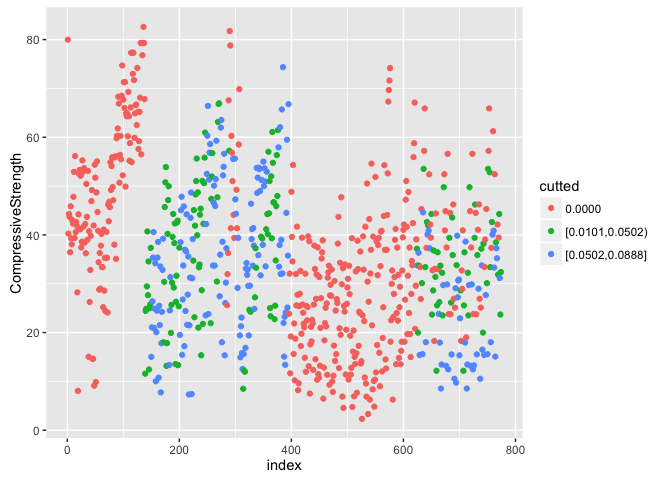
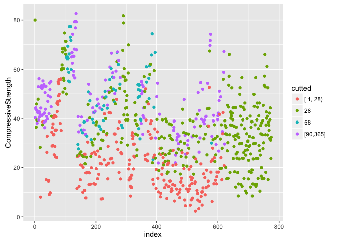
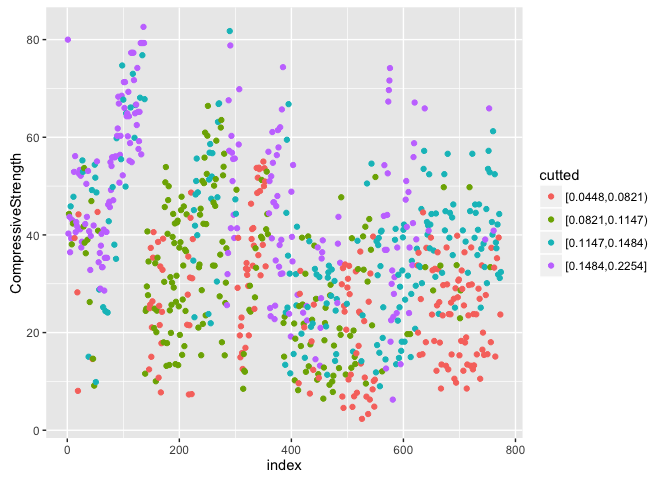
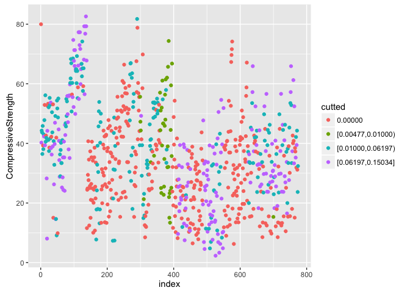
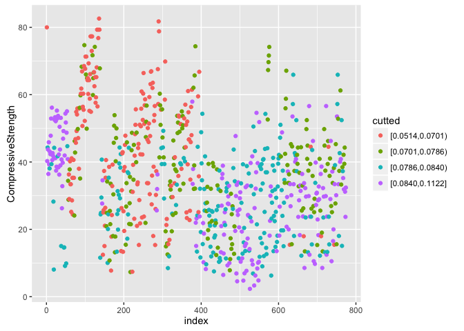
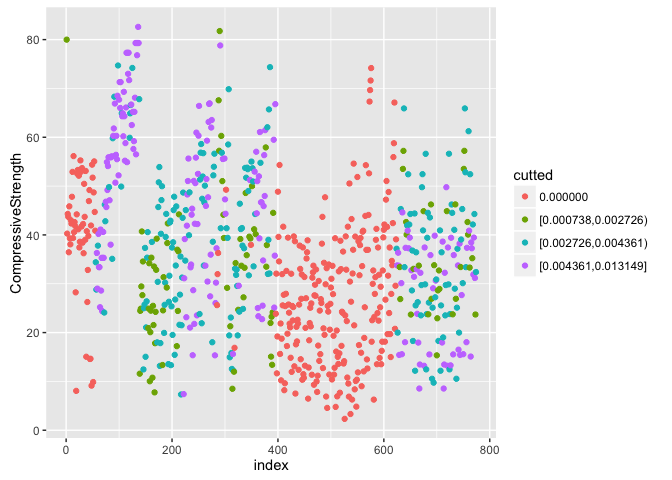
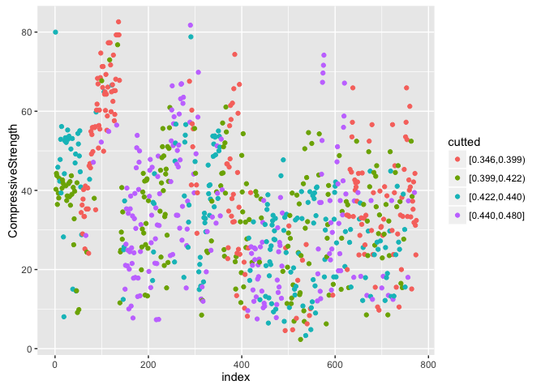
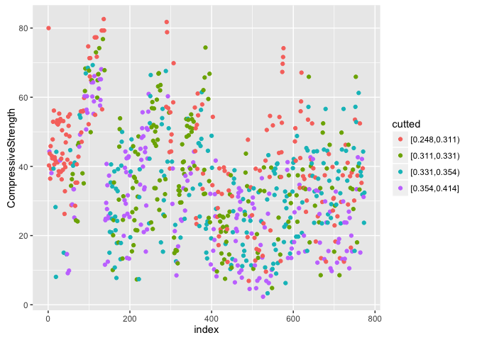
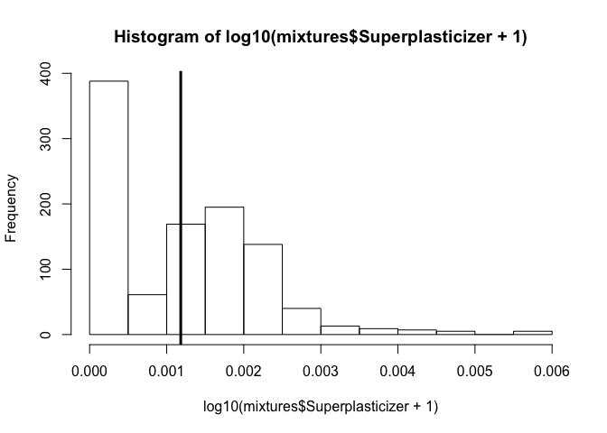

Question 1
----------

Load the Alzheimer's disease data using the commands:

library(AppliedPredictiveModeling)
data(AlzheimerDisease)

Which of the following commands will create non-overlapping training and test sets with about 50% of the observations assigned to each?

``` r
library(AppliedPredictiveModeling)  
library(caret)
data(AlzheimerDisease) 
```

``` r
adData = data.frame(diagnosis,predictors)
trainIndex = createDataPartition(diagnosis, p = 0.50, list=FALSE)
training = adData[trainIndex,]
testing = adData[-trainIndex,]
dim(training); dim(testing)
```

    ## [1] 167 131

    ## [1] 166 131

``` r
sum(row.names(training) %in% row.names(testing))
```

    ## [1] 0

Question 2
----------

Load the cement data using the commands:

library(AppliedPredictiveModeling)
data(concrete)
library(caret)
set.seed(1000)
inTrain = createDataPartition(mixtures$CompressiveStrength, p = 3/4)\[\[1\]\]
training = mixtures\[ inTrain,\]
testing = mixtures\[-inTrain,\]

Make a plot of the outcome (CompressiveStrength) versus the index of the samples. Color by each of the variables in the data set (you may find the cut2() function in the Hmisc package useful for turning continuous covariates into factors). What do you notice in these plots?

``` r
library(AppliedPredictiveModeling)
data("concrete")
library(caret)
set.seed(1000)
inTrain <- createDataPartition(mixtures$CompressiveStrength, p=3/4)[[1]]
training <- mixtures[inTrain, ]
testing <- mixtures[-inTrain, ]
```

``` r
library(Hmisc)
index <- 1:nrow(training)
cutted <- cut2(training$FlyAsh, g=4)
qplot(index, CompressiveStrength, data=training, col=cutted)
```

<!-- -->

``` r
cutted <- cut2(training$Age, g=4)
qplot(index, CompressiveStrength, data=training, col=cutted)
```

<!-- -->

``` r
cutted <- cut2(training$Cement, g=4)
qplot(index, CompressiveStrength, data=training, col=cutted)
```

<!-- -->

``` r
cutted <- cut2(training$BlastFurnaceSlag, g=4)
qplot(index, CompressiveStrength, data=training, col=cutted)
```

<!-- -->

``` r
cutted <- cut2(training$Water, g=4)
qplot(index, CompressiveStrength, data=training, col=cutted)
```

<!-- -->

``` r
cutted <- cut2(training$Superplasticizer, g=4)
qplot(index, CompressiveStrength, data=training, col=cutted)
```

<!-- -->

``` r
cutted <- cut2(training$CoarseAggregate, g=4)
qplot(index, CompressiveStrength, data=training, col=cutted)
```

<!-- -->

``` r
cutted <- cut2(training$FineAggregate, g=4)
qplot(index, CompressiveStrength, data=training, col=cutted)
```

<!-- -->

``` r
# There is a non-random pattern in the plot of the outcome versus index that does not appear to be perfectly explained by any predictor suggesting a variable may be missing.
```

Question 3
----------

Load the cement data using the commands:

library(AppliedPredictiveModeling)
data(concrete)
library(caret)
set.seed(1000)
inTrain = createDataPartition(mixtures$CompressiveStrength, p = 3/4)\[\[1\]\]
training = mixtures\[ inTrain,\]
testing = mixtures\[-inTrain,\]

Make a histogram and confirm the SuperPlasticizer variable is skewed. Normally you might use the log transform to try to make the data more symmetric. Why would that be a poor choice for this variable?

``` r
library(AppliedPredictiveModeling)   
data(concrete)    
library(caret)   
set.seed(1000)  
inTrain = createDataPartition(mixtures$CompressiveStrength, p = 3/4)[[1]]   
training = mixtures[ inTrain,]  
testing = mixtures[-inTrain,]

hist(log10(mixtures$Superplasticizer+1), breaks = 10)
abline(v=median(log10(mixtures$Superplasticizer+1)), lwd=3)
```

<!-- -->

``` r
# There are a large number of values that are the same and even if you took the log(SuperPlasticizer + 1) they would still all be identical so the distribution would not be symmetric.
```

Question 4
==========

Load the Alzheimer's disease data using the commands:

library(caret)
library(AppliedPredictiveModeling)
set.seed(3433)data(AlzheimerDisease)
adData = data.frame(diagnosis,predictors)
inTrain = createDataPartition(adData$diagnosis, p = 3/4)\[\[1\]\]training = adData\[ inTrain,\]
testing = adData\[-inTrain,\]

Find all the predictor variables in the training set that begin with IL. Perform principal components on these variables with the preProcess() function from the caret package. Calculate the number of principal components needed to capture 90% of the variance. How many are there?

``` r
library(caret)   
library(AppliedPredictiveModeling)  
set.seed(3433)
data(AlzheimerDisease)  
adData = data.frame(diagnosis,predictors)  
inTrain = createDataPartition(adData$diagnosis, p = 3/4)[[1]]
training = adData[ inTrain,]   
testing = adData[-inTrain,]     

cols <- grep("^IL", names(training))
prepro <- preProcess(training[,cols], method=c("pca", "center", "scale"), thresh=0.9)
prepro
```

    ## Created from 251 samples and 12 variables
    ## 
    ## Pre-processing:
    ##   - centered (12)
    ##   - ignored (0)
    ##   - principal component signal extraction (12)
    ##   - scaled (12)
    ## 
    ## PCA needed 9 components to capture 90 percent of the variance

Question 5
----------

Load the Alzheimer's disease data using the commands:

library(caret)
library(AppliedPredictiveModeling)
set.seed(3433)
data(AlzheimerDisease)
adData = data.frame(diagnosis,predictors)
inTrain = createDataPartition(adData$diagnosis, p = 3/4)\[\[1\]\]
training = adData\[ inTrain,\]
testing = adData\[-inTrain,\]

Create a training data set consisting of only the predictors with variable names beginning with IL and the diagnosis. Build two predictive models, one using the predictors as they are and one using PCA with principal components explaining 80% of the variance in the predictors. Use method="glm" in the train function.

What is the accuracy of each method in the test set? Which is more accurate?

``` r
library(caret)   
library(AppliedPredictiveModeling)  
library(dplyr)
set.seed(3433)   
data(AlzheimerDisease)  
adData = data.frame(diagnosis,predictors)   
inTrain = createDataPartition(adData$diagnosis, p = 3/4)[[1]]   
training = adData[ inTrain,]   
testing = adData[-inTrain,]   

new.training <- training %>%
        select(diagnosis, grep("^IL", names(training)))
new.testing <- testing %>%
        select(diagnosis, grep("^IL", names(testing)))

# Model 1
model1 <- train(diagnosis ~ ., data=new.training, method="glm")
predict1 <- predict(model1, new.testing)
confusionMatrix(new.testing$diagnosis, predict1)
```

    ## Confusion Matrix and Statistics
    ## 
    ##           Reference
    ## Prediction Impaired Control
    ##   Impaired        2      20
    ##   Control         9      51
    ##                                          
    ##                Accuracy : 0.6463         
    ##                  95% CI : (0.533, 0.7488)
    ##     No Information Rate : 0.8659         
    ##     P-Value [Acc > NIR] : 1.00000        
    ##                                          
    ##                   Kappa : -0.0702        
    ##  Mcnemar's Test P-Value : 0.06332        
    ##                                          
    ##             Sensitivity : 0.18182        
    ##             Specificity : 0.71831        
    ##          Pos Pred Value : 0.09091        
    ##          Neg Pred Value : 0.85000        
    ##              Prevalence : 0.13415        
    ##          Detection Rate : 0.02439        
    ##    Detection Prevalence : 0.26829        
    ##       Balanced Accuracy : 0.45006        
    ##                                          
    ##        'Positive' Class : Impaired       
    ## 

``` r
# Model 2 with PCA
prepro2 <- preProcess(new.training[,-1], method="pca", thresh=0.8)
train2 <- predict(prepro2, new.training)
test2 <- predict(prepro2, new.testing)
model2 <- train(diagnosis ~., data=train2, method="glm")
predict2 <- predict(model2, test2)
confusionMatrix(test2$diagnosis, predict2)
```

    ## Confusion Matrix and Statistics
    ## 
    ##           Reference
    ## Prediction Impaired Control
    ##   Impaired        3      19
    ##   Control         4      56
    ##                                           
    ##                Accuracy : 0.7195          
    ##                  95% CI : (0.6094, 0.8132)
    ##     No Information Rate : 0.9146          
    ##     P-Value [Acc > NIR] : 1.000000        
    ##                                           
    ##                   Kappa : 0.0889          
    ##  Mcnemar's Test P-Value : 0.003509        
    ##                                           
    ##             Sensitivity : 0.42857         
    ##             Specificity : 0.74667         
    ##          Pos Pred Value : 0.13636         
    ##          Neg Pred Value : 0.93333         
    ##              Prevalence : 0.08537         
    ##          Detection Rate : 0.03659         
    ##    Detection Prevalence : 0.26829         
    ##       Balanced Accuracy : 0.58762         
    ##                                           
    ##        'Positive' Class : Impaired        
    ##
