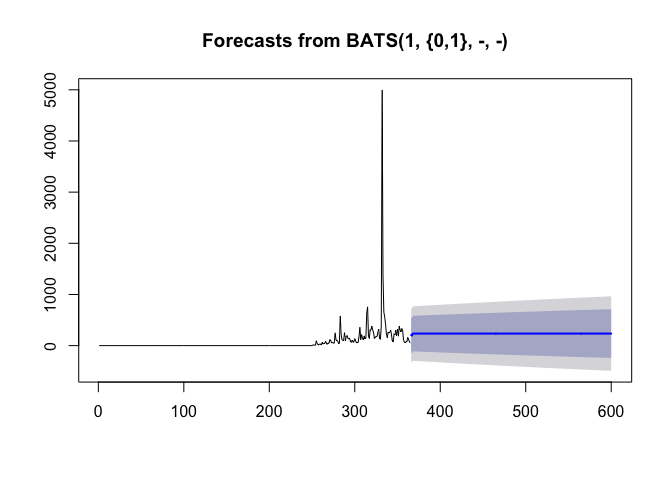

Question 1
----------

Load the vowel.train and vowel.test data sets:

-code--code-

library(ElemStatLearn)

data(vowel.train)

data(vowel.test)

-/code--/code-

Set the variable y to be a factor variable in both the training and test set. Then set the seed to 33833. Fit (1) a random forest predictor relating the factor variable y to the remaining variables and (2) a boosted predictor using the "gbm" method. Fit these both with the train() command in the caret package.

What are the accuracies for the two approaches on the test data set? What is the accuracy among the test set samples where the two methods agree?

``` r
library(ElemStatLearn); library(caret)
data(vowel.train)
data(vowel.test)

vowel.train$y <- as.factor(vowel.train$y)
vowel.test$y <- as.factor(vowel.test$y)

set.seed(33833)
mod.fit1 <- train(y ~ ., data=vowel.train, method="rf")
mod.fit2 <- train(y ~ ., data=vowel.train, method="gbm", verbose=FALSE)

pred1 <- predict(mod.fit1, vowel.test)
pred2 <- predict(mod.fit2, vowel.test)

confusionMatrix(pred1, vowel.test$y)$overall["Accuracy"]
```

    ##  Accuracy 
    ## 0.6147186

``` r
confusionMatrix(pred2, vowel.test$y)$overall["Accuracy"]
```

    ##  Accuracy 
    ## 0.5367965

``` r
agree.index <- which(pred1==pred2)
confusionMatrix(pred1[agree.index], vowel.test$y[agree.index])$overall["Accuracy"]
```

    ##  Accuracy 
    ## 0.6656051

Question 2
----------

Load the Alzheimer's data using the following commands

-code-

library(caret)

library(gbm)

set.seed(3433)

library(AppliedPredictiveModeling)

data(AlzheimerDisease)

adData = data.frame(diagnosis,predictors)

inTrain = createDataPartition(adData$diagnosis, p = 3/4)\[\[1\]\]

training = adData\[ inTrain,\]

testing = adData\[-inTrain,\]

-/code-

Set the seed to 62433 and predict diagnosis with all the other variables using a random forest ("rf"), boosted trees ("gbm") and linear discriminant analysis ("lda") model. Stack the predictions together using random forests ("rf"). What is the resulting accuracy on the test set? Is it better or worse than each of the individual predictions?

``` r
library(caret); library(gbm)
set.seed(3433)
library(AppliedPredictiveModeling)
data(AlzheimerDisease)

adData = data.frame(diagnosis,predictors)
inTrain = createDataPartition(adData$diagnosis, p = 3/4)[[1]]
training = adData[ inTrain,]
testing = adData[-inTrain,]

set.seed(62433)

mod.fit1 <- train(diagnosis ~ ., data=training, method = "rf")
mod.fit2 <- train(diagnosis ~ ., data=training, method = "gbm", verbose=FALSE)
mod.fit3 <- train(diagnosis ~ ., data=training, method="lda")

pred1 <- predict(mod.fit1, testing)
pred2 <- predict(mod.fit2, testing)
pred3 <- predict(mod.fit3, testing)

confusionMatrix(pred1, testing$diagnosis)$overall["Accuracy"]
```

    ##  Accuracy 
    ## 0.7682927

``` r
confusionMatrix(pred2, testing$diagnosis)$overall["Accuracy"]
```

    ##  Accuracy 
    ## 0.7926829

``` r
confusionMatrix(pred3, testing$diagnosis)$overall["Accuracy"]
```

    ##  Accuracy 
    ## 0.7682927

``` r
comb.df <- data.frame(pred1, pred2, pred3, diag = testing$diagnosis)
comb.mod.fit <- train(diag ~ ., data=comb.df, method="rf")
```

    ## note: only 2 unique complexity parameters in default grid. Truncating the grid to 2 .

``` r
comb.pred <- predict(comb.mod.fit, testing)

confusionMatrix(comb.pred, testing$diagnosis)$overall["Accuracy"]
```

    ## Accuracy 
    ## 0.804878

Question 3
----------

Load the concrete data with the commands:

-code-

set.seed(3523)

library(AppliedPredictiveModeling)

data(concrete)

inTrain = createDataPartition(concrete$CompressiveStrength, p = 3/4)\[\[1\]\]

training = concrete\[ inTrain,\]

testing = concrete\[-inTrain,\]

-/code-

Set the seed to 233 and fit a lasso model to predict Compressive Strength. Which variable is the last coefficient to be set to zero as the penalty increases? (Hint: it may be useful to look up ?plot.enet).

``` r
set.seed(3523)
library(AppliedPredictiveModeling)
data(concrete)

inTrain = createDataPartition(concrete$CompressiveStrength, p = 3/4)[[1]]
training = concrete[ inTrain,]
testing = concrete[-inTrain,]

set.seed(233)
mod.fit <- train(CompressiveStrength ~ ., data=concrete, method="lasso")
plot.enet(mod.fit$finalModel, xvar="penalty", use.color=TRUE)
```

<!-- -->

``` r
# From the plot, we can see that cement would be the last coefficient to be set to zero as the penalty increases.

# Demonstrated by numbers
mod.fit$finalModel$beta.pure
```

    ##        Cement BlastFurnaceSlag     FlyAsh      Water Superplasticizer
    ## 0  0.00000000      0.000000000 0.00000000  0.0000000       0.00000000
    ## 1  0.02320506      0.000000000 0.00000000  0.0000000       0.00000000
    ## 2  0.02794701      0.000000000 0.00000000  0.0000000       0.08295564
    ## 3  0.04244358      0.000000000 0.00000000  0.0000000       0.44756064
    ## 4  0.04456323      0.002909698 0.00000000  0.0000000       0.48106506
    ## 5  0.06478346      0.034402224 0.00000000 -0.1083247       0.55464597
    ## 6  0.06827773      0.040594791 0.00000000 -0.1487687       0.57016862
    ## 7  0.09502458      0.073501517 0.04899895 -0.1933310       0.33485669
    ## 8  0.10204819      0.082270221 0.06229150 -0.2100687       0.27093678
    ## 9  0.10344848      0.084074370 0.06473263 -0.2103927       0.26859286
    ## 10 0.11980433      0.103865809 0.08793432 -0.1499184       0.29222460
    ##    CoarseAggregate FineAggregate        Age
    ## 0      0.000000000   0.000000000 0.00000000
    ## 1      0.000000000   0.000000000 0.00000000
    ## 2      0.000000000   0.000000000 0.00000000
    ## 3      0.000000000   0.000000000 0.03468983
    ## 4      0.000000000   0.000000000 0.03818058
    ## 5      0.000000000   0.000000000 0.07729919
    ## 6      0.000000000  -0.006867341 0.08738981
    ## 7      0.000000000   0.000000000 0.10553810
    ## 8      0.000000000   0.000000000 0.11091544
    ## 9      0.001182544   0.000000000 0.11176264
    ## 10     0.018086215   0.020190351 0.11422207
    ## attr(,"scaled:scale")
    ## [1] 3352.3583 2767.6713 2052.8978  685.0013  191.6291 2494.1937 2571.8875
    ## [8] 2026.3663

Question 4
----------

Load the data on the number of visitors to the instructors blog from here:

<https://d396qusza40orc.cloudfront.net/predmachlearn/gaData.csv>

Using the commands:

-code-

library(lubridate) \# For year() function below

dat = read.csv("~/Desktop/gaData.csv")

training = dat\[year(dat$date) &lt; 2012,\]

testing = dat\[(year(dat$date)) &gt; 2011,\]

tstrain = ts(training$visitsTumblr)

-/code-

Fit a model using the bats() function in the forecast package to the training time series. Then forecast this model for the remaining time points. For how many of the testing points is the true value within the 95% prediction interval bounds?

``` r
# download.file("https://d396qusza40orc.cloudfront.net/predmachlearn/gaData.csv", "gaData.csv", "curl")

library(forecast)
library(lubridate) # For year() function below

dat <- read.csv("gaData.csv")

training <- dat[year(dat$date) < 2012,]
testing <- dat[(year(dat$date)) > 2011,]
tstrain <- ts(training$visitsTumblr)

mod.fit <- bats(tstrain)
mod.fc <- forecast(mod.fit, h=nrow(testing))
plot(mod.fc)
```

<!-- -->

``` r
lower.95 <- mod.fc$lower[,2]
upper.95 <- mod.fc$upper[,2]

sum(testing$visitsTumblr > lower.95 & testing$visitsTumblr < upper.95) / nrow(testing)
```

    ## [1] 0.9617021

Question 5
----------

Load the concrete data with the commands:

-code-

set.seed(3523)

library(AppliedPredictiveModeling)

data(concrete)

inTrain = createDataPartition(concrete$CompressiveStrength, p = 3/4)\[\[1\]\]

training = concrete\[ inTrain,\]

testing = concrete\[-inTrain,\]

-/code-

Set the seed to 325 and fit a support vector machine using the e1071 package to predict Compressive Strength using the default settings. Predict on the testing set. What is the RMSE?

``` r
set.seed(3523)
library(AppliedPredictiveModeling)
data(concrete)

inTrain = createDataPartition(concrete$CompressiveStrength, p = 3/4)[[1]]
training = concrete[ inTrain,]
testing = concrete[-inTrain,]

set.seed(325)
library(e1071)
# svm -- Support Vector Machine
mod.fit <- svm(CompressiveStrength ~ ., data=training)
pred <- predict(mod.fit, testing)
RMSE(pred, testing$CompressiveStrength)
```

    ## [1] 6.715009
