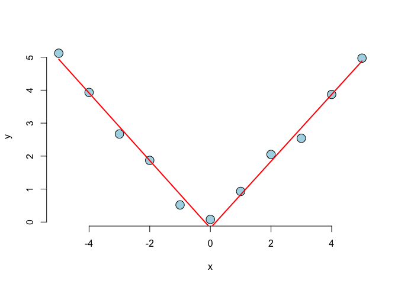

Question 1
----------

Consider the space shuttle data ?𝚜𝚑𝚞𝚝𝚝𝚕𝚎 in the 𝙼𝙰𝚂𝚂 library. Consider modeling the use of the autolander as the outcome (variable name 𝚞𝚜𝚎). Fit a logistic regression model with autolander (variable auto) use (labeled as "auto" 1) versus not (0) as predicted by wind sign (variable wind). Give the estimated odds ratio for autolander use comparing head winds, labeled as "head" in the variable headwind (numerator) to tail winds (denominator).

``` r
library(MASS); library(dplyr)
data("shuttle")

shuttle <- mutate(shuttle, useNum = 1 * (use == "auto"),
                  windNum = 1 * (wind == "head"))
mdl <- glm(useNum ~ windNum, family = binomial, data = shuttle)
exp(mdl$coef[1] + mdl$coef[2])/exp(mdl$coef[1])
```

    ## (Intercept) 
    ##   0.9686888

Question 2
----------

Consider the previous problem. Give the estimated odds ratio for autolander use comparing head winds (numerator) to tail winds (denominator) adjusting for wind strength from the variable magn.

``` r
mdl <- glm(useNum ~ windNum + magn, family = binomial, data = shuttle)
exp(mdl$coef[1] + mdl$coef[2])/exp(mdl$coef[1])
```

    ## (Intercept) 
    ##   0.9684981

Question 3
----------

If you fit a logistic regression model to a binary variable, for example use of the autolander, then fit a logistic regression model for one minus the outcome (not using the autolander) what happens to the coefficients?

``` r
# The coefficients reverse their signs.
```

Question 4
----------

Consider the insect spray data 𝙸𝚗𝚜𝚎𝚌𝚝𝚂𝚙𝚛𝚊𝚢𝚜. Fit a Poisson model using spray as a factor level. Report the estimated relative rate comapring spray A (numerator) to spray B (denominator).

``` r
data("InsectSprays")
mdl <- glm(count ~ factor(spray) - 1, family = poisson, data = InsectSprays)
exp(mdl$coef[1])/exp(mdl$coef[2])
```

    ## factor(spray)A 
    ##      0.9456522

Question 5
----------

Consider a Poisson glm with an offset, t. So, for example, a model of the form 𝚐𝚕𝚖(𝚌𝚘𝚞𝚗𝚝 ~ 𝚡 + 𝚘𝚏𝚏𝚜𝚎𝚝(𝚝), 𝚏𝚊𝚖𝚒𝚕𝚢 = 𝚙𝚘𝚒𝚜𝚜𝚘𝚗) where 𝚡 is a factor variable comparing a treatment (1) to a control (0) and 𝚝 is the natural log of a monitoring time. What is impact of the coefficient for 𝚡 if we fit the model 𝚐𝚕𝚖(𝚌𝚘𝚞𝚗𝚝 ~ 𝚡 + 𝚘𝚏𝚏𝚜𝚎𝚝(𝚝𝟸), 𝚏𝚊𝚖𝚒𝚕𝚢 = 𝚙𝚘𝚒𝚜𝚜𝚘𝚗) where 𝟸 &lt;- 𝚕𝚘𝚐(𝟷𝟶) + 𝚝? In other words, what happens to the coefficients if we change the units of the offset variable. (Note, adding log(10) on the log scale is multiplying by 10 on the original scale.)

``` r
# The coefficient estimate is unchanged
```

Question 6
----------

Consider the data

x &lt;- -5:5 y &lt;- c(5.12, 3.93, 2.67, 1.87, 0.52, 0.08, 0.93, 2.05, 2.54, 3.87, 4.97)

Using a knot point at 0, fit a linear model that looks like a hockey stick with two lines meeting at x=0. Include an intercept term, x and the knot point term. What is the estimated slope of the line after 0?

``` r
x <- -5:5
y <- c(5.12, 3.93, 2.67, 1.87, 0.52, 0.08, 0.93, 2.05, 2.54, 3.87, 4.97)

knots <- 0
splineTerms <- sapply(knots, function(knot) (x>knot)*(x-knot))
xMat <- cbind(1, x, splineTerms)
yhat <- predict(lm(y ~ xMat - 1))
plot(x, y, frame.plot = FALSE, pch=21, bg="lightblue", cex=2)
lines(x, yhat, col="red", lwd=2)
```

<!-- -->

``` r
(yhat[11] - yhat[7]) / (11-7)
```

    ##       11 
    ## 1.013067
