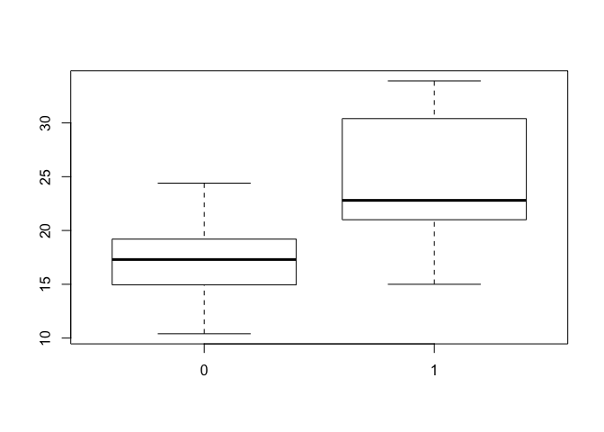
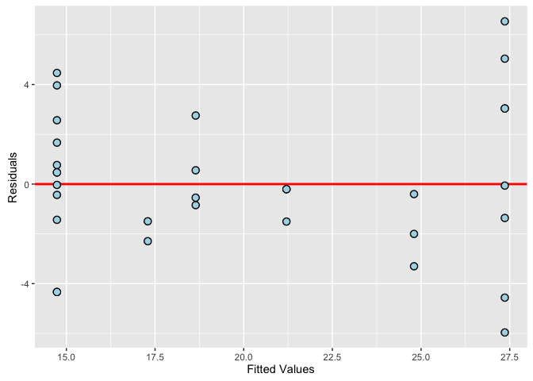

*Executive Summary*
===================

This document explores the relationship between a set of variables and miles per gallon (MPG). The analysis focuses on the following two questions:

1.  “Is an automatic or manual transmission better for MPG”
2.  "Quantify the MPG difference between automatic and manual transmissions"

*The Data Set*
==============

The Motor Trend Car Road Tests dataset is being used in this analysis. The followings are the descriptions of the variables:

mpg: Miles/ gallon
cyl: Number of cylinders
disp: Displacement
hp: Gross horsepower
drat: Rear axle ratio
wt: Weight (1000 lbs)
qsec: 1/4 mile time
vs: V/S
am: Transmission (0 = automatic, 1 = manual)
gear: Number of forward gears
carb: Number of carburetors

``` r
data(mtcars)
head(mtcars)
```

    ##                    mpg cyl disp  hp drat    wt  qsec vs am gear carb
    ## Mazda RX4         21.0   6  160 110 3.90 2.620 16.46  0  1    4    4
    ## Mazda RX4 Wag     21.0   6  160 110 3.90 2.875 17.02  0  1    4    4
    ## Datsun 710        22.8   4  108  93 3.85 2.320 18.61  1  1    4    1
    ## Hornet 4 Drive    21.4   6  258 110 3.08 3.215 19.44  1  0    3    1
    ## Hornet Sportabout 18.7   8  360 175 3.15 3.440 17.02  0  0    3    2
    ## Valiant           18.1   6  225 105 2.76 3.460 20.22  1  0    3    1

*Analysis*
==========

``` r
par(mfrow=c(1,1))
with(mtcars, plot(factor(am), mpg))
```

<!-- -->

From the box plot, we can see that manual transmission tends to have higher MPG than automatic transmission.

``` r
fit1 <- lm(mpg ~ factor(am), data = mtcars)
fit2 <- update(fit1, . ~ . + factor(cyl))
fit3 <- update(fit2, . ~ . + disp)
fit4 <- update(fit3, . ~ . + hp)
fit5 <- update(fit4, . ~ . + drat)
fit6 <- update(fit5, . ~ . + wt)
fit7 <- update(fit6, . ~ . + qsec)
fit8 <- update(fit7, . ~ . + factor(vs))
fit9 <- update(fit8, . ~ . + factor(gear))
fit10 <- update(fit9, . ~ . + factor(carb))
anova(fit1, fit2, fit3, fit4, fit5, fit6, fit7, fit8, fit9, fit10)
```

    ## Analysis of Variance Table
    ## 
    ## Model  1: mpg ~ factor(am)
    ## Model  2: mpg ~ factor(am) + factor(cyl)
    ## Model  3: mpg ~ factor(am) + factor(cyl) + disp
    ## Model  4: mpg ~ factor(am) + factor(cyl) + disp + hp
    ## Model  5: mpg ~ factor(am) + factor(cyl) + disp + hp + drat
    ## Model  6: mpg ~ factor(am) + factor(cyl) + disp + hp + drat + wt
    ## Model  7: mpg ~ factor(am) + factor(cyl) + disp + hp + drat + wt + qsec
    ## Model  8: mpg ~ factor(am) + factor(cyl) + disp + hp + drat + wt + qsec + 
    ##     factor(vs)
    ## Model  9: mpg ~ factor(am) + factor(cyl) + disp + hp + drat + wt + qsec + 
    ##     factor(vs) + factor(gear)
    ## Model 10: mpg ~ factor(am) + factor(cyl) + disp + hp + drat + wt + qsec + 
    ##     factor(vs) + factor(gear) + factor(carb)
    ##    Res.Df    RSS Df Sum of Sq       F   Pr(>F)    
    ## 1      30 720.90                                  
    ## 2      28 264.50  2    456.40 28.4297 7.89e-06 ***
    ## 3      27 230.46  1     34.04  4.2402  0.05728 .  
    ## 4      26 183.04  1     47.42  5.9078  0.02809 *  
    ## 5      25 182.38  1      0.66  0.0820  0.77855    
    ## 6      24 150.10  1     32.28  4.0216  0.06331 .  
    ## 7      23 141.21  1      8.89  1.1081  0.30916    
    ## 8      22 139.02  1      2.18  0.2719  0.60964    
    ## 9      20 134.00  2      5.02  0.3128  0.73606    
    ## 10     15 120.40  5     13.60  0.3388  0.88144    
    ## ---
    ## Signif. codes:  0 '***' 0.001 '**' 0.01 '*' 0.05 '.' 0.1 ' ' 1

From the anova tests, we can see that model 2 fits the best among all because of its small p-value. However, we still need to test the normality of its residuals.

``` r
shapiro.test(fit2$residuals)
```

    ## 
    ##  Shapiro-Wilk normality test
    ## 
    ## data:  fit2$residuals
    ## W = 0.98002, p-value = 0.8001

Since p-value is 0.8001, which is way larger than 0.05, we fails to reject the null hypothesis that the residuals for model 2 are approxmately normal.

``` r
fit2
```

    ## 
    ## Call:
    ## lm(formula = mpg ~ factor(am) + factor(cyl), data = mtcars)
    ## 
    ## Coefficients:
    ##  (Intercept)   factor(am)1  factor(cyl)6  factor(cyl)8  
    ##       24.802         2.560        -6.156       -10.068

``` r
confint(fit2, level = 0.94)
```

    ##                       3 %      97 %
    ## (Intercept)   22.20934625 27.394357
    ## factor(am)1    0.01652205  5.103385
    ## factor(cyl)6  -9.16634416 -3.145891
    ## factor(cyl)8 -12.91383923 -7.221280

From the coefficients, keeping other variables constant, we can see that if we use manual transmission, the predicted MPG will be increased by 2.560. So the MPG difference between automatic and manual transmissions is 2.560, with confidence interval (0.02, 5.10).

From the confidence interval, we are 94% confident that manual transmission is better for MPG than automatic transmission.

``` r
anova(fit2)
```

    ## Analysis of Variance Table
    ## 
    ## Response: mpg
    ##             Df Sum Sq Mean Sq F value    Pr(>F)    
    ## factor(am)   1 405.15  405.15  42.890 4.233e-07 ***
    ## factor(cyl)  2 456.40  228.20  24.158 8.010e-07 ***
    ## Residuals   28 264.50    9.45                      
    ## ---
    ## Signif. codes:  0 '***' 0.001 '**' 0.01 '*' 0.05 '.' 0.1 ' ' 1

Since the p-value for factor(am) is small, we can reject the null hypothesis that there is no difference between the groups which were highlited in the model.

``` r
library(ggplot2)
ggplot(data.frame(x = fit2$fitted.values, y = fit2$residuals), aes(x = x, y = y)) +
        geom_hline(yintercept = 0, col = "red", size = 1) +
        geom_point(size=3, col = "black") + geom_point(size = 2, col = "lightblue") +
        xlab("Fitted Values") + ylab("Residuals")
```

<!-- --> The residuals look great because they are distributed evenly arount the line y=0.

*Conclusion*
============

1. We are 94% confident that a manual transmission is better for MPG than an automatic transmission.
----------------------------------------------------------------------------------------------------

2. The difference between automatic and manual transmissions is 2.560 with a 94% confidence interval from 0.02 to 5.10.
-----------------------------------------------------------------------------------------------------------------------
