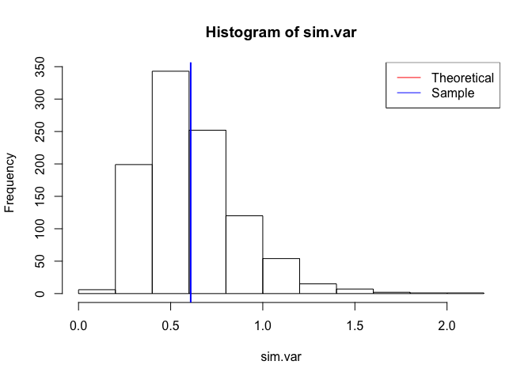

*Overview*
----------

This project investigates the exponential distribution in R and compares it with the Central Limit Theorem.

*Simulations*
-------------

This research sets labmda to 0.2 and investigates the distribution of averages of 40 exponentials. We will run 1000 simulations in this case. Here we only show the first two simulations.

``` r
lambda <- 0.2
n <- 40
nsim <- 1000

set.seed(1234)
sims <- matrix(rexp(n=n*nsim, rate=lambda), nsim, n)
head(sims, 2)
```

    ##           [,1]      [,2]     [,3]      [,4]     [,5]      [,6]      [,7]
    ## [1,] 12.508793 3.7841509 3.633601 3.8257179 4.917415 4.8973496 3.0990188
    ## [2,]  1.233794 0.7843467 2.485864 0.4996331 4.223800 0.6721408 0.7405205
    ##           [,8]     [,9]    [,10]     [,11]     [,12]     [,13]    [,14]
    ## [1,] 0.8902634 7.093695 1.008469 10.316080 0.5920054  4.178786 2.639991
    ## [2,] 6.7407159 2.014421 6.059352  6.160279 7.9614127 14.188178 7.633310
    ##         [,15]     [,16]    [,17]     [,18]     [,19]    [,20]    [,21]
    ## [1,] 14.39776 1.0840833 9.353465 0.7329379  3.822158 5.062343 4.391430
    ## [2,] 12.86960 0.4279639 1.078381 0.2763646 14.755800 1.568032 7.425546
    ##         [,22]    [,23]      [,24]    [,25]     [,26]    [,27]    [,28]
    ## [1,] 5.687523 4.434957 0.04974979 4.439129 10.590198 4.316737 8.634311
    ## [2,] 1.391239 1.162630 3.33569532 1.673395  5.059239 3.462844 0.906304
    ##          [,29]     [,30]     [,31]    [,32]     [,33]    [,34]     [,35]
    ## [1,] 0.7412488  3.200794 0.8234912 7.378749  4.395509 1.955222  2.619175
    ## [2,] 0.2237180 19.185081 2.4653469 5.882942 12.656620 3.647892 21.002905
    ##           [,36]    [,37]     [,38]    [,39]    [,40]
    ## [1,]  0.8539713 5.835020  8.970728 2.751601  4.19277
    ## [2,] 15.5183636 4.283506 15.274306 4.989497 18.79061

*Sample Mean versus Theoretical Mean*
-------------------------------------

Theoretical mean:

``` r
1/lambda
```

    ## [1] 5

Mean of Sample means:

``` r
sim.means <- apply(sims, 1, mean)
mean(sim.means)
```

    ## [1] 4.974239

``` r
hist(sim.means, xlab = "Sample Means", 
     main = "Comparison between sample mean and theoretical mean")
abline(v = 1/lambda, col = "red", lwd = 2)
abline(v = mean(sim.means), col = "blue", lwd = 2)
legend("topright", legend = c("Theoretical", "Sample"), col = c("red", "blue"), lty = 1)
```

<!-- -->

From the results, we can see that the mean of sample means we get from simulations is almost the same as our theoretical mean. Thus, in a hypothesis test, we cannot reject the null hypothesis that they are equal.

*Sample Variance versus Theoretical Variance*
---------------------------------------------

Theoretical variance:

``` r
1/((lambda^2)*n)
```

    ## [1] 0.625

Sample variance:

``` r
sim.var <- apply(sims, 1, var)/n
mean(sim.var)
```

    ## [1] 0.6088275

``` r
hist(sim.var)
abline(v = 1/lambda^2, col = "red", lwd = 2)
abline(v = mean(sim.var), col = "blue", lwd = 2)
legend("topright", legend = c("Theoretical", "Sample"), col = c("red", "blue"), lty = 1)
```

<!-- -->

From the results, we can see that the mean of sample variance we get from simulations is almost the same as our theoretical variance. Thus, in a hypothesis test, we cannot reject the null hypothesis that they are equal.

*Distribution*
--------------

The distribution of a large collection of random exponentials (n = 1000)

``` r
set.seed(1234)
hist(rexp(1000), xlab = "Random exponentials", main = "Random exponantials")
```

<!-- -->

The distribution of a large collection of averages of 40 exponentials (number of simulations = 1000)

``` r
hist(sim.means, xlab = "Averages of 40 exponentials", main = "Averages of 40 exponentials")
```

<!-- -->

From the results, we can see that the distribution of a large collection of averages of 40 exponentials is much more Gaussian than the distribution of a large collection of random exponentials. We can say the distribution of a large collection of averages of 40 exponentials is approximately normal because it's approximately symmetrical about the median, which is also its mode.
