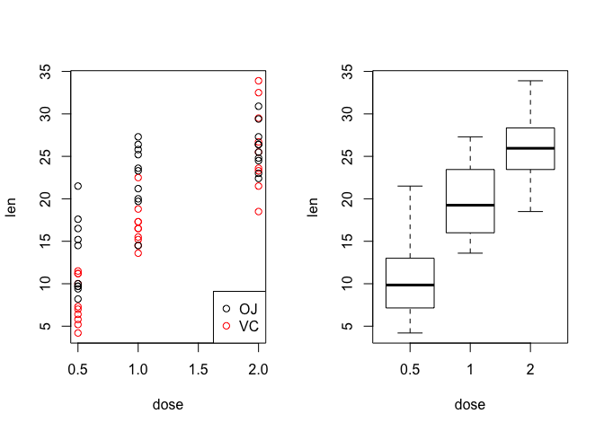

*Overview*
==========

This research performs the analysis on the ToothGrowth data in the R datasets package. The ToothGrowth data provides the measurements on the effects of Vitamin C on tooth growth in Guinea pigs.

*Exploratory Analysis*
======================

Look at the data
----------------

The ToothGrowth data contains 60 observations and 3 variables. Different doses of vitamin C (0.5, 1, and 2 mg/day) are applied to guinea pigs by one of the two delivery methods (OJ: orange juice, or VC: absorb acid)

``` r
ToothGrowth <- ToothGrowth
str(ToothGrowth)
```

    ## 'data.frame':    60 obs. of  3 variables:
    ##  $ len : num  4.2 11.5 7.3 5.8 6.4 10 11.2 11.2 5.2 7 ...
    ##  $ supp: Factor w/ 2 levels "OJ","VC": 2 2 2 2 2 2 2 2 2 2 ...
    ##  $ dose: num  0.5 0.5 0.5 0.5 0.5 0.5 0.5 0.5 0.5 0.5 ...

``` r
table(ToothGrowth$dose)
```

    ## 
    ## 0.5   1   2 
    ##  20  20  20

Some basic visualizations
-------------------------

``` r
par(mfrow = c(1,2))
with(ToothGrowth, plot(dose, len, col = supp))
legend("bottomright", legend = c("OJ", "VC"), col = c("black", "red"), pch = 1)
boxplot(len ~ dose, data = ToothGrowth, xlab = "dose", ylab = "len")
```

<!-- -->

Basic summary
-------------

1.  Larger dose tends to result in greater increase in the tooth lengths.
2.  Orange Juice delivery method tends to perform better for doses 0.5 and 1.0 mg/day.
3.  Absorb Acid delivery method tends to perform better for dose 2.0 mg/day.

*Tests for the summary*
=======================

1. Whether larger dose tends to result in greater increase in the tooth lengths.
--------------------------------------------------------------------------------

### Test 1: Whether dose 1.0 mg/day performs better than dose 0.5 mg/day. We perform the hypothesis test under 95% confidence level.

``` r
# H0: mu0 = mua
# Ha: mu0 < mua
dose0.5 <- ToothGrowth[ToothGrowth$dose==0.5,]
dose1.0 <- ToothGrowth[ToothGrowth$dose==1,]
t.test(dose0.5$len, dose1.0$len, alternative = "less")$p.value
```

    ## [1] 6.341504e-08

Since p-value is much less than 0.05, we can reject the null hypothesis that 1.0 mg/day and 0.5 mg/day have the same performance. Thus, 1.0 mg/day performs better than 0.5 mg/day.

### Test 2: Whether dose 2.0 mg/day performs better than dose 1.0 mg/day. We perform the hypothesis test under 95% confidence level.

``` r
# H0: mu0 = mua
# Ha: mu0 < mua
dose2.0 <- ToothGrowth[ToothGrowth$dose==2, ]
t.test(dose1.0$len, dose2.0$len, alternative = "less")$p.value
```

    ## [1] 9.532148e-06

Since p-value is much less than 0.05, we can reject the null hypothesis that 2.0 mg/day and 1.0 mg/day have the same performance. Thus, 2.0 mg/day performs better than 1.0 mg/day.

### Our tests shows that 2.0 mg/day performs better than 1.0 mg/day, and 1.0 mg/day performs better than 0.5 mg/day. Thus, larger dose tends to result in greater increase in the tooth lengths.

2. Whether orange Juice delivery method tends to perform better for doses 0.5 and 1.0 mg/day.
---------------------------------------------------------------------------------------------

### Test 1: Whether orange Juice delivery method tends to perform better for dose 0.5 mg/day.We perform the hypothesis test under 95% confidence level.

``` r
dose0.5_OJ <- dose0.5[dose0.5$supp=="OJ",]
dose0.5_VC <- dose0.5[dose0.5$supp=="VC",]
t.test(dose0.5_VC$len, dose0.5_OJ$len, alternative = "less")$p.value
```

    ## [1] 0.003179303

Since p-value is much less than 0.05, we can reject the null hypothesis that OJ and VC have the same performance for dose 0.5 mg/day. Thus, OJ performs better than VC for dose 0.5 mg/day.

### Test 2: Whether orange Juice delivery method tends to perform better for dose 1.0 mg/day.We perform the hypothesis test under 95% confidence level.

``` r
dose1.0_OJ <- dose1.0[dose1.0$supp=="OJ",]
dose1.0_VC <- dose1.0[dose1.0$supp=="VC",]
t.test(dose1.0_VC$len, dose1.0_OJ$len, alternative = "less")$p.value
```

    ## [1] 0.0005191879

Since p-value is much less than 0.05, we can reject the null hypothesis that OJ and VC have the same performance for dose 1.0 mg/day. Thus, OJ performs better than VC for dose 1.0 mg/day.

3. Whether absorb acid delivery method tends to perform better for doses 2.0 mg/day.
------------------------------------------------------------------------------------

### Test 1: Whether absorb acid delivery method tends to perform better for dose 2.0 mg/day.We perform the hypothesis test under 95% confidence level.

``` r
dose2.0_OJ <- dose2.0[dose2.0$supp=="OJ",]
dose2.0_VC <- dose2.0[dose2.0$supp=="VC",]
t.test(dose2.0_VC$len, dose2.0_OJ$len, alternative = "greater")$p.value
```

    ## [1] 0.4819258

Since p-value is greater than 0.05, we cannot reject the null hypothesis that OJ and VC have the same performance for dose 2.0 mg/day.

*Conclusions*
=============

Under 95% confidence level: 1. Larger dose tends to result in greater increase in the tooth lengths.
2. Orange Juice delivery method tends to perform better for doses 0.5 and 1.0 mg/day.
3. Absorb Acid delivery method and Orange Juice delivery method have the same performance for dose 2.0 mg/day.
